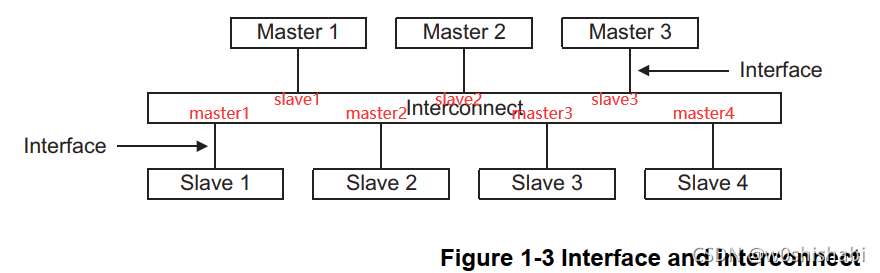
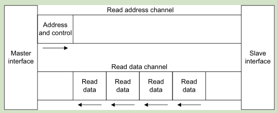
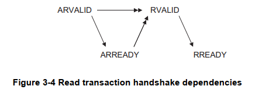
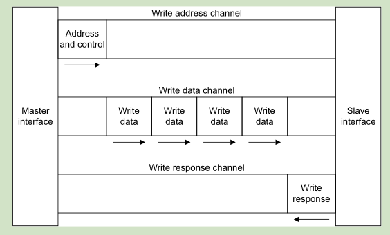
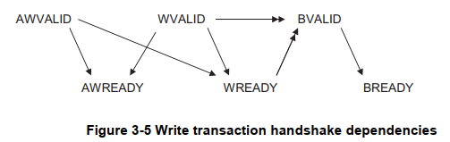
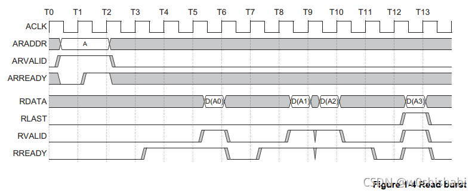
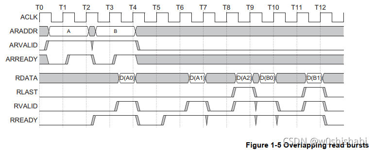
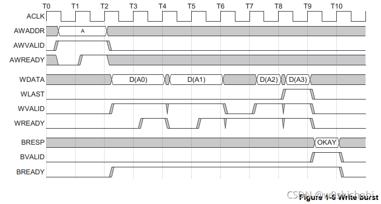
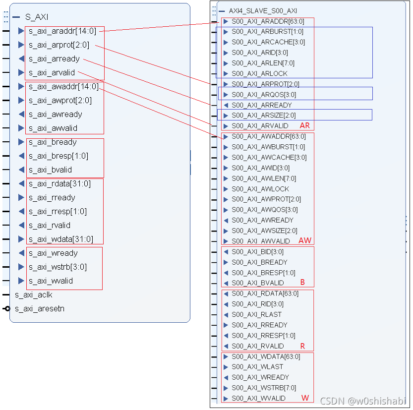

w-EE-协议-AXI
=============

关于 About
----------

* 标签：~wiki
* 创建：2020-12-22

内容 Content
------------

### 基本概念

* 背景 [^20230207_174017]
    * AMBA 是 ARM 1996年首次引入的一种微控制器总线。
    * 2003年发行的AMBA3.0 引入了AXI。2010年发行的AMBA4.0 包含了AXI的第二版：AXI4。
* 定义
    * AXI（Advanced eXtensible Interface）是一种总线协议
    * 该协议是ARM公司提出的AMBA（Advanced Microcontroller Bus Architecture）协议中最重要的部分
* 分类 [^20230207_174017]
    * AXI4（AXI4-Full）
        * 满足高性能内存映射（memory-mapped）需求
        * 支持256长度突发（burst）传输（仅限 INCR 突发类型，其他突发类型仍是 16）
    * AXI4-Lite
        * 对于简单的、低吞吐量的内存映射（memory-mapped）通信（例如，与控制寄存器和状态寄存器之间的通信）
        * 不可突发传输（burst）
    * AXI4-Stream（ARM 与 Xilinx 共同提出，主要用于 FPGA [^20230207_174239]）
        * 用于高速流数据
        * 不需要地址
        * 允许无限的数据突发大小
    * ACE4：AXI Coherency Extensions，基于 AXI4 的缓存一致性扩展接口 [^20230207_174239]
* 应用
    * ARM 架构、Xilinx FPGA
    * 其实很少用到完整的 AXI 协议：[digital logic - Why is axi bus popular for fpga? - Electrical Engineering Stack Exchange](https://electronics.stackexchange.com/questions/378373/why-is-axi-bus-popular-for-fpga) [20230627]
* 资料
    * Spec
        * [AMBA AXI and ACE Protocol Specification Version H.c](https://developer.arm.com/documentation/ihi0022)
        * [UG1037: Vivado AXI Reference Guide](https://docs.xilinx.com/v/u/en-US/ug1037-vivado-axi-reference-guide)
    * Example Code
        * SystemVerilog Interface Example: [https://raw.githubusercontent.com/pulp-platform/axi/master/src/axi_intf.sv](https://raw.githubusercontent.com/pulp-platform/axi/master/src/axi_intf.sv) [20220621]

### AXI4

#### 特点

* 数据、地址分开，读、写分开，非常双工 [^20230208_130413]
* 支持突发传输，且只需要一个起始地址，支持非对齐的突发起始地址 [^20230207_174017]
* 支持一定程度上的乱序传输 [^20230208_130413]
* 添加寄存器级很容易 [^20230208_130413]
* 向后兼容 APB 和 AHB [^20230208_130413]

#### 拓扑

[^20230207_174017]

* Components
    * AXI Master Device：一个 Master Interface
    * AXI Slave Device：一个 Slave Interface
    * AXI Interconnect：多个 Master/Slave Interface
        * 主要功能 [^20201222_125057]
            * Frequency Conversion：允许任意 master/slave 工作在不同的时钟 [^20230207_174017]
            * Data Bus Width Conversion
            * Interface Protocol Conversion
            * Buffering Components
            * Routing, Arbitration [20240115]
* Interface：Master 和 Slave 接口的配置可参考手册 or 一些文章如 [AMBA interconnector PL301(一) - _9_8 - 博客园](https://www.cnblogs.com/-9-8/p/4748997.html)

#### 信号

> AXI4/AXI3/AXI4-Lite 可以只有全局信号 + 3 个写通道（write-only interface）或全局信号 + 2 个读通道（read-only interface）[^20230410_171605]
>
> 每个通道里有的 pin 是必须的，有的是可选的，位宽、默认值、AXI3/AXI4 的支持情况可看 [AXI3和AXI4协议详细说明_徐晓康的博客的博客-CSDN博客_axi3协议](https://blog.csdn.net/weixin_42837669/article/details/107633017)[^20230208_130413]

* 全局 [^20230207_174239]

    | 信号名  | 源     |
    | ------- | ------ |
    | ACLK    | 时钟源 |
    | ARESETn | 复位源 |

* 读地址通道（Read Address Channel）[^20230207_174239]

    | 信号名   | 源     | 描述                                                 |
    | -------- | ------ | ---------------------------------------------------- |
    | ARID     | Master | 读地址ID，用来标志一组读信号                         |
    | ARADDR   | Master | 读地址，一次突发读的首地址                           |
    | ARLEN    | Master | 突发长度，突发读传输数据的个数                       |
    | ARSIZE   | Master | 突发大小，每次突发传输的字节数                       |
    | ARBURST  | Master | 突发类型，FIXED，INCR，WRAP                          |
    | ARLOCK   | Master | 总线锁信号，normal, exclusive, locked（AXI3 only）   |
    | ARCACHE  | Master | Cache类型，表明一次事务的cacheable特征：             |
    |          |        | bufferable, cacheable, read-allocate, write-allocate |
    | ARPROT   | Master | 保护类型，传输的特权级及安全等级                     |
    | ARQOS    | Master | 质量服务QoS，可作为安全级标志（AXI3 不支持）         |
    | ARREGION | Master | 域标记，可以实现一个物理地址与多个逻辑地址的映射     |
    |          |        | 也可以对某些地址进行保护（AXI3 不支持）              |
    | ARUSER   | Master | 用户自定义信号（AXI3 不支持）                        |
    | ARVALID  | Master | 有效信号，表明此通道的地址控制信号有效               |
    | ARREADY  | Slave  | 从设备已经准备好接受地址和控制信息                   |

    * ARLEN AXI3 要求宽度为 4-bit，AXI4 要求宽度为 8-bit [^20230414_125233]
    * ARLOCK AXI3 要求宽度为 2-bit，AXI4 要求宽度为 1-bit [^20230414_125233]
* 读数据通道（Read Data Channel）[^20230207_174239]

    | 信号名 | 源     | 描述                          |
    | ------ | ------ | ----------------------------- |
    | RID    | Slave  | 一次读传输的ID                |
    | RDATA  | Slave  | 读数据                        |
    | RRESP  | Slave  | 读响应，表明读传输的状态      |
    | RLAST  | Slave  | 突发读传输的最后一个数据      |
    | RUSER  | Slave  | 用户自定义信号（AXI3 不支持） |
    | RVALID | Slave  | 读有效                        |
    | RREADY | Master | 表明从机可以接收读数据        |

    * 对于支持 RLAST 信号的 master，不是突发传输也应该有 RLAST driven。[^20230403_160620]
    * 对于 master 来说 RLAST 是可选信号，但对于 slave 是必须的。[^20230403_160538]
* 写地址通道（Write Address Channel）[^20230207_174239]

    | 信号名   | 源     | 描述                                                 |
    | -------- | ------ | ---------------------------------------------------- |
    | AWID     | Master | 写地址ID，用来标志一组写信号                         |
    | AWADDR   | Master | 写地址，一次突发写的首地址                           |
    | AWLEN    | Master | 突发长度，突发写传输数据的个数                       |
    | AWSIZE   | Master | 突发大小，每次突发传输的字节数                       |
    | AWBURST  | Master | 突发类型，FIXED，INCR，WRAP                          |
    | AWLOCK   | Master | 总线锁信号，normal, exclusive, locked                |
    | AWCACHE  | Master | Cache类型，表明一次事务的cacheable特征               |
    |          |        | bufferable, cacheable, read-allocate, write-allocate |
    | AWPROT   | Master | 保护类型，传输的特权级及安全等级                     |
    | AWQOS    | Master | 质量服务QoS，可作为安全级标志                        |
    | AWREGION | Master | 域标记，可以实现一个物理地址与多个逻辑地址的映射     |
    |          |        | 也可以对某些地址进行保护                             |
    | AWUSER   | Master | 用户自定义信号                                       |
    | AWVALID  | Master | 有效信号，表明此通道的地址控制信号有效               |
    | AWREADY  | Slave  | 从设备已经准备好接受地址和控制信息                   |

    * AWLEN AXI3 要求宽度为 4-bit，AXI4 要求宽度为 8-bit [^20230414_125233]
    * AWLOCK AXI3 要求宽度为 2-bit，AXI4 要求宽度为 1-bit [^20230414_125233]
* 写数据通道（Write Data Channel）[^20230207_174239]

    | 信号名 | 源     | 描述                                            |
    | ------ | ------ | ----------------------------------------------- |
    | WID    | Master | 一次写传输的ID（只有 AXI3 支持）                |
    | WDATA  | Master | 写数据                                          |
    | WSTRB  | Master | 写数据有效的字节线，用来表明哪8bits数据是有效的 |
    | WLAST  | Master | 突发写传输的最后一个数据                        |
    | WUSER  | Master | 用户自定义信号（AXI3 不支持）                   |
    | WVALID | Master | 写有效                                          |
    | WREADY | Slave  | 表明从机可以接收写数据                          |

    * 对于支持 WLAST 信号的 slave，不是突发传输也应该有 WLAST driven。[^20230403_160620]
    * 对于 slave 来说 WLAST 是可选信号，但对于 master 是必须的。[^20230403_160538]
* 写响应通道（Write Response Channel）[^20230207_174239]

    | 信号名 | 源     | 描述                          |
    | ------ | ------ | ----------------------------- |
    | BID    | Slave  | 写响应ID                      |
    | BRESP  | Slave  | 写响应，表明写事务的状态      |
    |        |        | OKAY，EXOKAY，SLVERR，DECERR  |
    | BUSER  | Slave  | 用户自定义信号（AXI3 不支持） |
    | BVALID | Slave  | 写响应有效                    |
    | BREADY | Master | 表明主机能够接收写响应        |

* 低功耗信号 [^20230207_174239]

    | 信号名  | 源         | 描述                                             |
    | ------- | ---------- | ------------------------------------------------ |
    | CSYSREQ | 时钟控制器 | 系统退出低功耗请求，此信号从“时钟控制器”到“外设" |
    | CSYSACK | 外设       | 退出低功耗状态确认                               |
    | CACTIVE | 外设       | 外设请求时钟有效                                 |

#### 基本传输

* 全局复位
    * ARESETn（异步、低有效）有效时，master 和 slave 必须将所有自己控制的 VALID 拉低，其他信号无所谓。[^20230208_130413]
* 握手方式
    * 所有通道统一的 valid / ready 握手 [^20230207_174239]
        * valid / ready 拉高的先后顺序不重要，谁先谁后一起来都可以
        * 只有能采到 valid / ready 同时为高时，那一个周期的数据对对方是有效的
    * 注意防止死锁！[^20230207_174017]
        * 示例：master 决定在 slave ready 之后才拉高 valid，slave 决定在 master valid 之后才拉高 ready
        * 方法：事务中一个 AXI 组件的 valid 信号不能依赖于另一个组件的 ready 信号，而 ready 可以（也可以不等待直接 assert 反而更有效率）等待 valid。[^20230207_174017]
        * 补充：但在现实中还是有 valid 等 ready 的设计（如 Xilinx BRAM IP），故尽量不要让 valid 和 ready 互相 block。[^20230207_174017]
* master读slave
    * 
    * 通道顺序
        * 读数据必须在读地址搞定之后 [^20230207_174017]
    * 握手 dependency [^20230207_174017]
        * 
        * 单箭头指向 可以在前一个信号（本信号）断言之前或之后断言的信号（指向的信号）。
        * 双箭头指向 只有在前一个信号（本信号）断言之后才可以断言的信号（指向的信号）。
* master写slave
    * 
    * 通道顺序
        * **写地址通道，可以在写数据通道出现的时候或之后才有效**。[^20230207_174017]
            * 数据比地址还早的可能性 [^20230403_142410]
                1. 在 source、destination 之间的 timing 要求可能使设计者往写地址通道放入比写数据通道更多的 register 和 buffer，造成写数据比写地址到达得早。
                2. 地址可能需要 translation，而数据不需要，造成写数据比写地址到达得早。
            * 如果 destination 需要先获得地址才能处理数据怎么办？[^20230403_142410]
                * 在地址没收到/处理完的情况下，先用 AWREADY stall 住数据即可。
        * 但写响应必须在最后一个写传输（无论是地址还是数据）之后出现！[^20230207_174017]
    * 握手 dependency [^20230207_174017]
        * 
        * 单箭头指向 可以在前一个信号（本信号）断言之前或之后断言的信号（指向的信号）。
        * 双箭头指向 只有在前一个信号（本信号）断言之后才可以断言的信号（指向的信号）。
* Response 架构
    * 怎么用的？
        * 写数据接收完毕后，slave 会单独发一个周期的写响应，一次 burst 只对应一次响应
        * 读数据的响应跟随每个读数据发送，一个有效的数据周期同时就发送一个响应，一次 burst 有多少个数据就有多少次响应。
    * 编码（对于 RRESP 和 BRESP 是一样的 [^20230207_174239]）
        * OKAY('b00)：正常访问成功
        * EXOKAY('b01)：Exclusive 访问成功
        * SLVERR('b10)：从机错误。表明访问已经成功到了 slave，但 slave 希望返回一个错误的情况给 master。例如 buffer 越界、timeout。
        * DECERR('b11)：译码错误。一般由 interconnect 给出，表明没有对应的 slave 地址，也可以例化一个 default slave 起到这个作用。

#### Outstanding 能力

* Outstanding 表示正在进行中（未完成）的意思。
* 若一个 Master 的 Outstanding 能力为 0，则 master 在读/写通道上必须在发送一个读/写地址之后就开始等待 response 返回，才能发下一个读/写地址。[^20230410_173307]
* 若一个 Master 的 Outstanding 能力大于 1，则 master 在读/写通道上可连续发 N 个读/写地址，再开始等待 response 返回，返回几个就又可以发几个读/写地址。[^20230410_173307] Master 的 Outstanding 能力一般用 READ/WRITE_ISSUING_CAPACITY 参数来表示，一般决定了这个 master interface 的写操作 FIFO 深度。如果这个 write issuing capability 小于对面 slave interface 的 write acceptance capability 可能会影响性能。[^20201222_125057]

#### 突发传输（Burst Transfer）

* 配置 [^20230207_174017]
    * 突发长度是 `AxLEN + 1` 个（对于 AWLEN 和 ARLEN 是一样的）
        * 即突发传输中一共有多少次 transfer
    * 突发字节数是 `2^AxSIZE` 字节（对于 AWSIZE 和 ARSIZE 是一样的）
        * 即突发传输中的每一次 transfer 有几个字节的数据
    * 突发类型（对于 AWBURST 和 ARBURST 是一样的）
        * b00：FIXED，即固定地址 burst，如用于 FIFO
        * b01：INCR，即增量地址 burst，如用于连续地址的 memory
        * b10：WRAP，即增量地址+循环 burst，如用于 cache line，具体规则可见 [^20230207_174239]
        * b11：RESERVED
* 规则 [^20230207_174239]
    * wrapping burst 的 burst 长度必须是 2、4、8、16，即 AxLEN 必须为 1、3、7、15
    * burst 不能跨 4KB 边界
    * 不支持提前终止 burst 传输
        * 写 burst 中，主机可以通过解断言所有的写的 strobes 来使非所有的写字节来减少写传输的数量。
        * 读 burst 中，主机可以忽略后续的读数据来减少读个数。
* 时序示例 [^20230207_174017]
    * Read Burst
        * 
    * Read Burst 重叠
        * 
    * Write Burst
        * 

#### 乱序传输

通过使用 xID 信号实现，xID 须保证目前每个未完成的 transaction 是 unique 的

* 工作方式 [^20230208_130413]
    * xID 包括 AWID、WID（仅在AXI3中实现）、BID、ARID、RID
    * 当 master 连接到 AXI interconnect 时，interconnect 会将一个附加位（如 master 对应的 interconnect 上的 slave 口的编号）加到该 master 侧的 ARID、AWID、WID上。这有两个效果：
        * master 不必知道其他 master 使用哪些 ID 值，因为 interconnect 通过附加位加到原始标识符上，使每个 master 使用的 ID 值唯一。
        * slave 端的 xID 信号接口比 master 上宽（有 interconnect 的附加位了）
    * slave to master 的 BID（写响应）和 RID（读数据），在传到 master 前 interconnect 会把附加位删掉。
    * WID 存在的 AXI3，几次写地址和写数据可能是 out-of-order 的，对于没有 WID 的 AXI4，写数据的顺序要和写地址一样。[^20230410_173307]
* 原则 [^20230208_133402]
    1. All data transfers must be issued in same order as address sequence
    2. Transactions with different IDs can complete in any order
        * 可以使响应快的 slave 先完成 [^20230207_174017]
    3. The master can have multiple transactions but they need to complete in order.

#### 非对齐传输（Unaligned Transfer）

1. 地址不对齐：如 32-bit 数据的起始地址为 0x1、0x2、0x3，WSTRB 为全 1。[^20240115_175802]
2. 数据部分有效：如 32-bit 数据的起始地址为 0x0，但 WSTRB 不为全 1。如果 WSTRB 为全 0，数据仍然会传输至总线上，直到 slave 端判断 WSTRB 无效才不会写入。[^20240115_175802]

#### 原子访问（Atomic Access）

* 概念：a particular memory region can be accessed without being corrupted by other write operations
    * master 发起事务的性质由 AxLOCKED 来表示，事务的成功与否由 slave 发出的 xRESP 来表示
* locked 访问（只有 AXI3 支持）
    * 当一个 master 发起了对某个 slave 的 locked access，interconnect 必须确保只有该 master 可以访问目标 slave 区域，直到同一个 master 的一个非锁定传输的事务完成
    * 可能对 interconnect 性能产生影响，而 exclusive 访问不需要将 bus 锁定
* exclusive 访问
    * slave 内部有个“Exclusive Access Monitoring hardware”来管理 exclusive 访问 [^20230208_133402]
    * 基本流程 [^20230208_142503]
        1. master 对 slave 的一个地址执行独占 read。slave 中的 monitor 会记录下该 master 的 ARID 和 ARADDR 到一个表里
        2. master 对**相同**的地址执行独占 write，slave 比对是否 AWID == ARID 和 AWADDR == ARADDR。
        3. 如果此 ADDR 仍然在表里（即该地址内容在两次读写之间没有被别的 master 改变），则独占 write 操作成功，slave会返回 EXOKEY，并更新该地址的内容；否则 slave 会返回 OKEY 代表独占 write 失败（不会根据此次独占 write 更新该地址的内容）。
    * 更复杂的流程 [^20230208_141532]
        1. master 对 slave 的地址 ADDR 执行 ID = 0 的独占 read，monitor 将 ID 和 ADDR 记在表里
        2. master 对 slave 的地址 ADDR 执行 ID = 1 的独占 read，monitor 将 ID 和 ADDR 记在表里
        3. master 对 slave 的地址 ADDR 执行 ID = 0 的独占 write，monitor 比对发现 ADDR 和 ID 都在表里，返回 EXOKEY 并更新 memory；由于更新了 memory，monitor 将表里所有 ADDR 的条目都删除
        4. master 对 slave 的地址 ADDR 执行 ID = 1 的独占 write，monitor 比对发现 ADDR 不在表里，返回 OKEY，独占写失败，不会更新 memory

#### Timeout 问题

> AXI 没有 Timeout 概念/机制。如果 xVALID 有效，它必须保持有效直到 xREADY 有效为止。如果 slave 它因为任何原因挂掉了，这个 xVALID 就会永久性地等待下去（remain pending），reset 是唯一的破解方法。[^20230406_152430]

Hang 住了应该如何处理？[^20230406_152430]

* 原理 [^20230406_152430]
    * 如果只有一个 master 和一个 slave（不存在 interconnect）
        * 如果一个 transfer 还没有发起，如 AWVALID 有效，而 AWREADY 一直无效的情况：仅 reset slave 即可
        * 如果一个 trasfer 已经发起了，如 AW transfer 结束、WVALID 有效，而 WREADY 一直无效的情况；或 BRESP 一直没有完成的情况：等待此 transfer 完成后仅 reset slave，或同时 reset master 和 slave
    * 如果有多个 master / slave（通常存在 interconnect）
        * Interconnect 存在的系统通常比较复杂，难以判断仅 reset 某个 master 或 slave 是否安全，故无论什么情况都需要同时 reset 所有 master 和 slave。
* 如何避免？[^20230406_152430]
    * 尽量将 slave 设计成不会 hang 住的样子。
    * 若 slave 无法避免 hang 住，如 slave 是外接光纤，如果拔掉了线它就会 hang。可以用 ATB 或 AIB 加在 master 和 slave 中间。
* 现成解决方案：当然你也可以自己写一团 counter 逻辑=。=
    * 使用 ATB（AXI Timeout Bridge）[^20230406_152430]：以 Zync 的 ATB 为例。
        * 功能：works as a watchdog timer for interconnect hang.
        * 原理：ATB keeps track of AXI transactions. It times out when the slave does not respond within a specific time. Then it responds to master with a response.
    * 使用 AIB（AXI Isolation Bridge）[^20230406_152430]：以 Zync 的 ATB 为例。
        * 功能：responsible for the functionally that isolates the AXI/APB master from the slave in preparation for powering down an AXI/APB master or slave.
        * 原理：When isolation is requested, the AIB blocks all new transactions generated by a master until all the outstanding interactions are completed by the slave, then isolates the slave by responding to all new transactions on behalf of the slave.
        * 特点：transparent and offers zero latency during normal transactions.

#### 保序问题

[AXI协议之读写命令保序_axi保序_谷公子的藏经阁的博客-CSDN博客](https://blog.csdn.net/W1Z1Q/article/details/100068720) [20230808]

#### Device 设计

* [Building the perfect AXI4 slave](https://zipcpu.com/blog/2019/05/29/demoaxi.html) [20230407_172707]
* [Building a basic AXI Master](https://zipcpu.com/blog/2020/03/23/wbm2axisp.html) [^20230418_164714]
    * [The hard part of building a bursting AXI Master](https://zipcpu.com/blog/2020/06/16/axiaddr-limits.html)
* AXI3 和 AXI4 互联要注意的问题：[AXI3与AXI4区别及互联 - 烓围玮未的文章 - 知乎](https://zhuanlan.zhihu.com/p/193006656) [20230726]

### AXI4-lite

* 与 AXI4 的接口信号对比
    *  [^20230207_174017]

### AXI4-Stream

* [带你快速入门AXI4总线--AXI4-Stream篇（1）----AXI4-Stream总线_孤独的单刀的博客-CSDN博客](https://blog.csdn.net/wuzhikaidetb/article/details/121326701)
    * tvalid & tready 时才能开始数据传输。

参考 Reference
--------------

[^20201222_125057]: * [x] [AMBA interconnector PL301(一) - _9_8 - 博客园](https://www.cnblogs.com/-9-8/p/4748997.html)
[^20230207_174017]: * [x] [AXI4协议学习：架构、信号定义、工作时序和握手机制_lu-ming.xyz的博客-CSDN博客_axi4协议](https://blog.csdn.net/lum250/article/details/120912567)
[^20230207_174239]: * [x] [AXI总线协议_ivy_reny的博客-CSDN博客_axi协议](https://blog.csdn.net/ivy_reny/article/details/56274238)
[^20230208_130413]: * [x] [AXI3和AXI4协议详细说明_徐晓康的博客的博客-CSDN博客_axi3协议](https://blog.csdn.net/weixin_42837669/article/details/107633017)
[^20230208_133402]: * [x] [Understanding the AMBA AXI4 Spec - Circuit Cellar](https://circuitcellar.com/research-design-hub/design-solutions/understanding-the-amba-axi4-spec/)
[^20230208_141532]: * [x] [[AXI 专题] AXI4 原子操作 锁定访问与独占访问 - pu1se - 博客园](https://www.cnblogs.com/pu1se/p/16707862.html)
[^20230208_142503]: * [x] [AXI 独占访问(Exclusive)和锁定访问(Locked )机制_restart0的博客-CSDN博客_axi 独占访问](https://blog.csdn.net/zmfmfking/article/details/120081488)
[^20230403_142410]: * [x] [AXI4 - Data before address - why? - Architectures and Processors forum - Support forums - Arm Community](https://community.arm.com/support-forums/f/architectures-and-processors-forum/49758/axi4---data-before-address---why)
[^20230403_160538]: * [x] [AXI4 isn't WLAST redundant ?](https://support.xilinx.com/s/question/0D52E00006hpePLSAY/axi4-isnt-wlast-redundant-?language=en_US)
[^20230403_160620]: * [x] [Learn the architecture - An introduction to AMBA AXI](https://developer.arm.com/documentation/102202/0300/Channel-transfers-and-transactions)
[^20230406_152430]: * [x] [How should a AXI MASTER or SLAVE behave when a xREADY signal is never asserted? - Architectures and Processors forum - Support forums - Arm Community](https://community.arm.com/support-forums/f/architectures-and-processors-forum/7182/how-should-a-axi-master-or-slave-behave-when-a-xready-signal-is-never-asserted)
[^20230410_171605]: * [x] [AXI Basics 1 - Introduction to AXI](https://support.xilinx.com/s/article/1053914?language=en_US)
[^20230410_173307]: * [x] [AXI 总线基本概念1 - 如何理解outstanding传输_总线outstanding_tbzj_2000的博客-CSDN博客](https://blog.csdn.net/tbzj_2000/article/details/88042890)
[^20230414_125233]: * [x] [Learn the architecture - An introduction to AMBA AXI](https://developer.arm.com/documentation/102202/0300/Channel-signals)
[^20240115_175802]: * [x] [AXI/CHI协议中的非对齐传输 unaligned transfer 的理解_非对齐地址的设计-CSDN博客](https://blog.csdn.net/weixin_45270982/article/details/108987862)