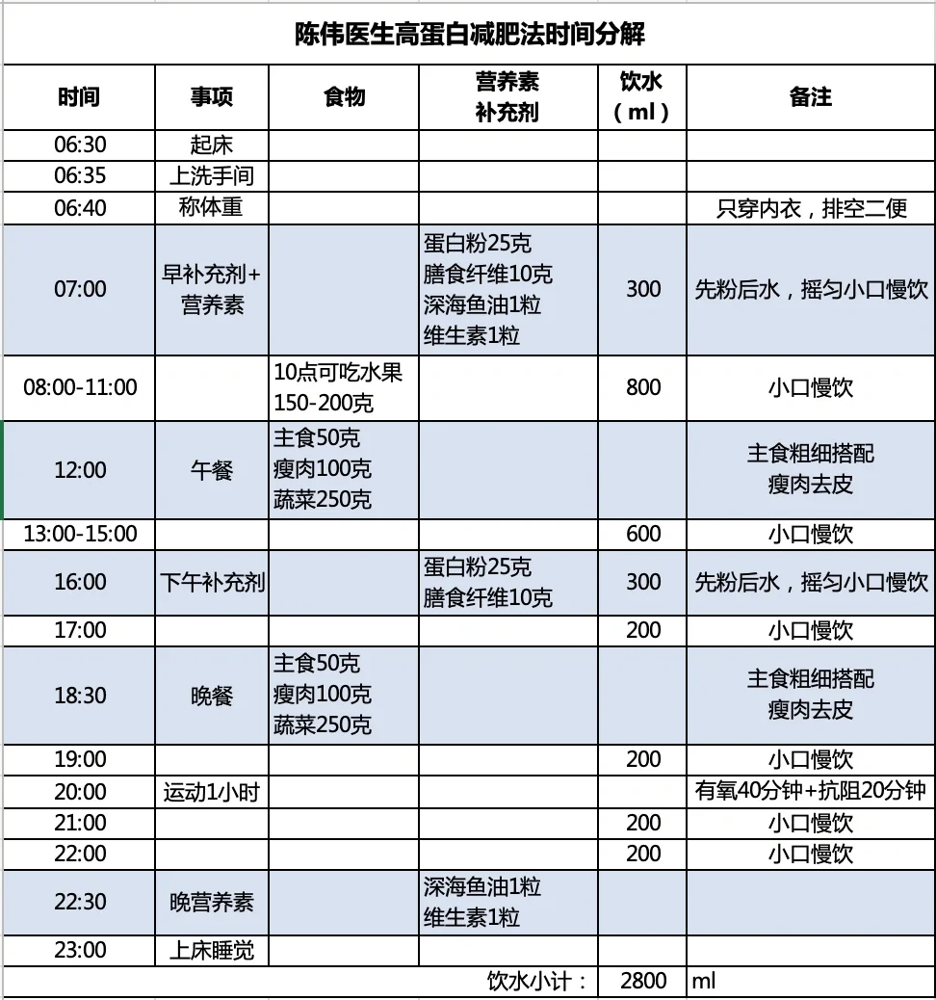

w-健康-减重-协和
================

关于 About
----------

* 标签：~wiki
* 创建：2024-05-06

### 摘要

北京协和营养科医学减重具体方案。

内容 Content
------------

### 整体方案

> 注意食量要随着体重变化而重新计算！！！包括补剂的量。

* 参考资料
    * 《给国人的医学减重指南》：作者北京协和医院医学减重专家陈伟医生，《中国超重/肥胖医学营养治疗指南（2021）》的普及版。侧重于理论。
    * 《协和专家医学减肥处方完全执行手册》：作者北京协和医院医学减重专家陈伟医生，侧重于实践。
        * 书摘：* [x] [协和专家医学减肥处方 - 小红书](https://www.xiaohongshu.com/explore/661d37b5000000001a00ea4d)
* 方案示例 [^协和减肥执行手册]
    > 每日记录体重、饮食情况，记录传给医生看，医生反馈，1 个月后复诊。
    * 快速减重期（2-6 个月）：高蛋白
    * 平台期（2 个月）：轻断食
    * 维持期（6 个月）：限能量

### 具体方法

#### 限能量均衡

> 和膳食指南推荐的方式基本一样。[^20240508_164042]

* 基本思想
    * 在满足人体基本营养需求（不搭配补剂）的基础上，配合合理运动，每天减少 1/3 或 1/4 摄入能量。[^协和减肥执行手册]
* 特点
    * 可以长期使用，但减肥速度慢，1-2kg/月 [^20240509_113308]
* 内容
    * 处方：[协和高蛋白减肥 | 毕业啦 | 小基数不容易 - 小红书](https://www.xiaohongshu.com/explore/663b661d000000001e01f231) [20240511_153434]
        * 本地版本：[20240511_153434_北京协和限能量平衡饮食方案.pdf](assets/w-健康-减重-协和/20240511_153434_北京协和限能量平衡饮食方案.pdf)
    * 通用食谱：每日的总量达到即可不必纠结每顿饭是否精确 [^协和减肥执行手册]
        * 1400kcal 示例
            * 早饭：主食 50g、鸡蛋 1 个、脱脂奶 250ml 或酸奶 100g
            * 午饭：主食 50g、蔬菜 250g、瘦肉 50g、其他蛋白质食物 50g、油 10g
            * 加餐：水果 150g
            * 晚饭：主食 50g、蔬菜 250g、瘦肉 50g、油 10g
        * 1600kcal 示例
            * 早饭：同 1400kcal
            * 午饭：在 1400kcal 基础上加主食 25g
            * 加餐：同 1400kcal
            * 晚饭：在 1400kcal 基础上加瘦肉 50g
        * 1800kcal 示例
            * 早饭：同 1400kcal
            * 午饭：同 1600kcal
            * 加餐：在 1400kcal 基础上加脱脂奶 250ml 或酸奶 100g
            * 晚饭：在 1600kcal 基础上加主食 25g
        * 饿的时候多吃高纤维的蔬菜、水果。
        * 减重忌口的可吃，但少吃！
    * 运动
        * 有氧：每周 3-4 次，一次 30 分钟
        * 阻抗：每周 3 次，每次 20 分钟
* 适用人群
    * 普通人推荐使用。但减重速度慢（1-2kg/月）。[^20240508_164042]

#### “5+2”轻断食

* 特点
    * 减肥速度比较快，2.5kg/月 [^20240509_113308]
* 内容
    * 处方：[北京协和营养科康教授处方拿走不谢 - 小红书](https://www.xiaohongshu.com/explore/663b96d3000000001e024bd4) [^20240510_214650]
        * 本地版本：[20240510_214650_北京协和轻断食方案.pdf](assets/w-健康-减重-协和/20240510_214650_北京协和轻断食方案.pdf)
        * 这个量是每月减 5kg，初始体重未知
        * 医生补充要点
            * 每天六顿饭，按时按点吃，少食多餐
            * 在家在外面吃饭最好用白开水涮两遍
            * 咀嚼30下再咽
            * 所有带“酱”字的东西远离，所有“汤”远离
            * 周一和周四轻断食
            * 早睡早起
            * 每天完成 3 分钟平板支撑和 10 分钟小哑铃练习手臂
    * 断食日通用食谱 [^协和减肥执行手册]
        * 早饭：2 小杯低脂酸奶、1 个水煮蛋
        * 中午：200g 水果
        * 晚饭：50g 瘦肉、250g 蔬菜、200g 薯类（或 50g 米饭）
        * 以上为食物生重。
    * 断食日保持维生素、蛋白质摄入，两个断食日不能连续。[^20240508_164042]

#### 高蛋白（5kg/月）

* 基本思想
    * 为了减少脂肪用低脂方式降低热量，为了维持肌肉和增加饱腹感大量使用蛋白粉和阻抗运动。
    * 热量缺口一天 1000kcal 左右，虽然有很多纤维和蛋白提升饱腹感，但在脂肪和碳水上算是节食。[^20240511_154013]
* 特点
    * 摄入蛋白多，减肥速度快，5kg/月。[^20240509_113308]
* 内容：医嘱不出差不旅游不过节不欺骗 [^20240511_222744]
    * 处方：[协和高蛋白减肥法 - 小红书](https://www.xiaohongshu.com/explore/64801b160000000011013093)
        * 本地版本：[20240506_172412_北京协和高蛋白饮食方案.pdf](assets/w-健康-减重-协和/20240506_172412_北京协和高蛋白饮食方案.pdf) [^20240506_172412]
        * 注意补剂也有少量脂肪、碳水的份量。
        * 如果上午饥饿难忍，可在 10 点增加 150-200g 低糖水果，不要等到马上吃午饭了再吃。[^20240511_155511]
    * 通用饮食 [^20240511_155511]
        * 
    * 关于补剂 [^协和减肥执行手册]
        * 蛋白粉（一天两顿）：1. 加速代谢，避免肌肉流失 [^20240511_220106] 2. 在低脂低糖情况下摄入蛋白质，帮助减肥。[^20240511_220106]
            * 如 nutrasumma（纽特舒玛）或 all Max 的分离乳清蛋白粉 [^20240511_151009] 也有可以医生开的协和蛋白粉。
            * 多个医生说不能跳过下午的蛋白粉，为了加速代谢。[^20240511_154526] 也有医生说如果不饿也可以不吃下午的蛋白粉。[^20240511_214549]
            * 如果蛋白粉时间和运动很近，可以放在运动后喝，如果相隔 1 小时及以上，按照原计划喝即可。[^20240511_220106]
            * 手头没有蛋白粉时可以用蛋清应急，1 蛋清 = 5g 蛋白粉 [^20240511_222744]
        * 纤维素（一天两顿）：增加饱腹感
        * 维生素（一天一次）：防止减肥时脱发，如善存 [^20240511_151009]、拜耳 [^20240506_172412]。
    * 关于运动：多吃多动，少吃少动。[^20240510_214548]
        * 吃了大量蛋白粉要足量运动，摄入的蛋白质必须用掉才能少让肾脏去代谢。[^20240510_214539]
        * 但不要超过 1 小时/天的运动，运动过量会假性增重（储水）。[^20240510_214548]
    * 关于喝水：一天 2 - 3L [^20240511_152840] [^20240511_154526]
    * 关于吃饭时间
        * 标准：晚饭 6 点半开吃，1 小时内吃完，8 点后封嘴！[^20240511_152840]
        * 医生说：短期内先吃饭再蛋白粉可以，但长期不建议。五点半-七点半之间开始吃晚饭都可以。[^20240511_131206]
        * 不能少吃一顿！因为身体认为没有足够食物供应时，首先就先分解肌肉来供能，再分解脂肪。[^20240511_220106]
    * 关于烹饪
        * 植物油<15g/天，食盐<6g/天
* 适用人群
    * 遵医嘱，提前做相应检查，包括肝肾功能（如尿酸高、三高、肝肾功能不全、甲亢、儿童都不行，但甲减有人被开高蛋白 [^20240511_154013]）等等。喝医生认可的可靠品牌的蛋白粉。普通人不建议全盘尝试。[^协和减肥执行手册]
    * 小基数可能不太适合高蛋白 [^20240506_172412]，但也有人被医生开了高蛋白 [^20240511_151009]。
* 问题
    * 月经不规律（推迟或不来），褐色出血，原因可能是脂肪、碳水摄入太少（如，第二个月月经就推迟，并有不规律出血）[^20240511_131206]
    * 大便困难（可能是菊粉原因，可换青汁），不停放臭屁（蛋白摄入过多没能用掉，只能靠肾脏代谢）；有些人喝完蛋白粉一周可缓解，但有人一直困难（不用开塞露就不行）。[^20240510_214539] 医生建议喝乳果糖/聚果糖缓解便秘。[^20240511_155956]
    * 非常饥饿，浑身乏力，只想吃碳水。碳水脑袋可以考虑放弃高蛋白，使用限能量+轻断食或碳循环。吃二甲双胍可能缓解。[^20240510_214548]
    * 不止一人说前期可能不会掉体重（前 10 天），需要坚持一段时间，后期效果很好。[^20240510_214548]
    * 有可能子宫肌瘤增大。但也有人开了高蛋白减重方案虽然有子宫肌瘤。[^20240511_155956]
    * 减重期间尿酸会高，所以甚至有尿酸本来就高的人被开了高蛋白减重（减重后就降低了），但也有人医生让先轻断食瘦了一些尿酸就不高了（看看是否是因为胖所以尿酸高）再继续高蛋白。[^20240511_155956]
    * 减完可能垮脸、眼皮耷拉，多练背！[^20240511_155956]

### 食物重量换算

> 以**可食用部分的生重**为准）[^20240511_142800]

* 100g 主食
    * = 100g 大米/白面/杂面/杂米/挂面/梳打饼干
    * = 240g 米饭 = 120g 馒头/面包 = 4-5 * 100g 土豆/红薯/山药
    * = 5-6 颗栗子 [^20240511_222744]
* 100g 蛋白质食物
    * = 100g 纯瘦肉 = 2 个鸡蛋 = 2 * 250ml 脱脂牛奶
    * = 70g 熟牛羊猪驴肉（去皮去肥）[^20240511_152840]
    * = 150g 生鱼虾肉 = 135g 熟鱼虾肉 [^20240511_152840] = 300g 带壳虾 [^20240511_222744]
    * = 150g 豆干 = 200g 豆腐 [^20240511_152840]
    * = 300g 南豆腐 = 400g 内酯豆腐 = 200g 鸭血 [^20240511_222744]
    * = 200g 纯蟹肉（蟹黄脂肪胆固醇高，不推荐）[^20240511_222744]
* 1g 盐 = 3g 蚝油 = 400mg 钠 [^20240511_222744]

参考 Reference
--------------

[^协和减肥执行手册]: 《协和专家医学减肥处方完全执行手册》
[^20240506_172412]: * [x] [协和高蛋白减肥法 - 小红书](https://www.xiaohongshu.com/explore/64801b160000000011013093)
[^20240508_164042]: * [x] [怎么看待北京协和医院的减肥食谱，会有效吗？ - 芝麻酱的回答 - 知乎](https://www.zhihu.com/question/435499783/answer/1646289978)
[^20240509_113308]: * [x] [协和医院分享科学减重秘籍，一个月最多可瘦十斤！_京报网](https://www.bjd.com.cn/tech/2020/12/18/37168t133.html)
[^20240510_214539]: * [x] [关于协和高蛋白减肥法的问题 - 小红书](https://www.xiaohongshu.com/explore/6630cffb000000001e034919)
[^20240510_214548]: * [x] [我决定暂时放弃协和高蛋白减肥法 - 小红书](https://www.xiaohongshu.com/explore/662bcf4c000000000d031add)
[^20240510_214650]: * [x] [北京协和营养科康教授处方拿走不谢 - 小红书](https://www.xiaohongshu.com/explore/663b96d3000000001e024bd4)
[^20240511_142800]: * [x] [协和减肥方案饮食注意事项 - 小红书](https://www.xiaohongshu.com/explore/66319d42000000001e0321b2)
[^20240511_151009]: * [x] [小基数《协和陈伟医生-高蛋白减肥》记录 - 小红书](https://www.xiaohongshu.com/explore/61961514000000002103f8ab)
[^20240511_131206]: * [x] [姨妈、运动、饮食｜该歇歇了｜协和高蛋白倒计时 - 小红书](https://www.xiaohongshu.com/explore/66397448000000001e02d200) 162cm
[^20240511_152840]: * [x] [协和高蛋白减肥 | 蛋白质怎么吃 | 生熟换算 - 小红书](https://www.xiaohongshu.com/explore/65aa464c0000000028025a90)
[^20240511_154013]: * [x] [协和高蛋白|130以下小基数年前瘦身看过来 - 小红书](https://www.xiaohongshu.com/discovery/item/65a72e64000000002802334c)
[^20240511_154526]: * [x] [协和高蛋白减肥中～ - 小红书](https://www.xiaohongshu.com/explore/66382d35000000001e020e64)
[^20240511_155511]: * [x] [协和陈伟高蛋白减脂法&amp;5+2轻断食尝试 - 小红书](https://www.xiaohongshu.com/explore/64abcc0a000000002301c198)
[^20240511_155956]: * [x] [减重一年，属于我的历史性时刻 - 小红书](https://www.xiaohongshu.com/explore/65fe5abc0000000012022d38)
[^20240511_214549]: * [x] [协和高蛋白减肥方案|陈伟医生-5个月52斤🎯 - 小红书](https://www.xiaohongshu.com/explore/6551ce5a000000000f02bc08)
[^20240511_220106]: * [x] [集中解答 - 小红书](https://www.xiaohongshu.com/explore/660c0251000000001b010937)
[^20240511_222744]: * [x] [协和高蛋白🥘饮食换算🍱日常咨询记录 - 小红书](https://www.xiaohongshu.com/explore/65e6b8a1000000000b021aa5)