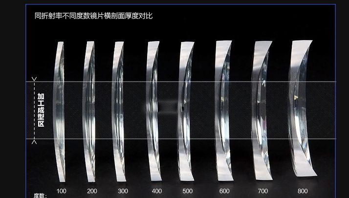

w-健康-器械-眼镜-框架
====================

关于 About
----------

* 标签：~wiki
* 创建：2019-01-24

### TODO

* [ ] [请问眼镜镜片选择尼康还是蔡司？ - 津门眼镜老张的回答 - 知乎](https://www.zhihu.com/question/350574856/answer/2538592427)
* [ ] [眼镜架是纯钛好还是β钛好，哪种价格更贵？](https://www.zhihu.com/question/23007354)
* [ ] [配近眼镜需要注意哪些细节？ - 无奔眼镜的回答 - 知乎](https://www.zhihu.com/question/609050107/answer/3097302189)
* [ ] [怎么选择适合自己的眼镜？ - 青崧的回答 - 知乎](https://www.zhihu.com/question/20779106/answer/75632457)
* [ ] [性价比配镜全攻略，线上&线下配眼镜全避坑指南（2022年09月更新） - 方少爷的文章 - 知乎](https://zhuanlan.zhihu.com/p/432947772)
* [ ] [配眼镜，如何挑选眼镜框和镜片？有哪些常识或技巧？ - 丁香医生的回答 - 知乎](https://www.zhihu.com/question/19856827/answer/157868263)

内容 Content
------------

Warning！高度近视（≥600）要小心眼底病变。

### 验配流程

> 综合考虑视觉品质（眼睛舒服）、美观（看着舒服）、佩戴舒适度（戴着舒服）
>
> 配镜真实成本=时间+精力+金钱+情绪+健康+二次支出。成本不仅仅只是眼前的钱和时间。[^20190125_231729]

* 验光 [^20190125_231729]
    > 验光的准确性是基础，没有准确的验光处方，镜片品质再好也没用。[^20190125_231729]
* 镜架选择 [^20190125_231729]
* 镜片选择 [^20190125_231729]
* 加工装配 [^20190125_231729]
    > 加工师的要求不亚于验光师。光学镜片只是半成品，加工师如果不靠谱，再好的镜片也无济于事。所以，选镜片前**先确认眼镜店的技术力量能否胜任**。[^20190125_231729]
    * **不要进行边缘抛光、钻石切割面工艺**，虽然看起来薄，但造成镜片炫光。[^20190125_231446]
    * **网上买镜片找加工不靠谱**，不如委托镜片供应方加工：自己提供镜片委托眼镜店加工，眼镜店的检测仪器没有能力检测镜片的多项参数是否合格，他们也不会承担镜片加工中损坏的风险（概率其实不低），也不会对加工之外的品质部分提供售后保证。风险太大，不建议。[^20190125_231729]
    * 瞳距：成年以后，瞳距是一个固定的数值，因瞳距配制误差导致斗鸡眼的可能性几乎为零。瞳距误差再大都不影响瞳距的数值，但会导致眼睛胀痛、头晕等不适症状。[^20190125_231729]
* 矫架 [^20190125_231729]
* 售后 [^20190125_231729]
    * 不定期的调整、维修 [^20230916_163338]
    * 很多眼镜店都可以随意进去免费修，不一定非得是你配眼镜的地方。[20230916@iPeng]

### 验光流程

* 确认验光师资质（初级、中级、高级、技师、高级技师）：有无验光师证书？验光师证书是几级？[^20230917_084257]

### 镜片选择

#### 参数指标

* 品牌
    > 大品牌技术研发、产品品质（光学指标、耐用舒适、不良风险）、品控等都更好，实际售价与其他品牌相差不大，大品牌镜片性价比其实很高。[^20190125_231729]
    * 举例
        * 一线：蔡司Zeiss（德），依视路Essilor（法），豪雅Hoya（日），精工，尼康Nikon（日），卡迪尔Cardior（大医院保真）
        * 凯米（二线品牌）、万新（2010年依视路收购万新）、大明、明月。
    * 防伪：验证真伪很难，厂家都分不出来 [^20190125_225201]
        * 镜片在没有专业仪器（绝大部分专业检测仪器眼镜店没有配备）检测的情况下，是无法断定镜片真伪的 [^20190125_231729]
        * 镜片防伪标识、包装、验证码都是可以作伪或者掉包的，难度不大。[^20190125_231729]
    * 产地：国外大品牌，几乎都在国内设厂多年，国内市场上的蔡司、依视路、豪雅镜片，都是国产的，但并不因国产，品质就不如进口。[^20190125_231729]
    * 注意
        * 全球范围内，还没有任何一家眼镜零售企业具有研发镜片的能力，他们自己注册的品牌，或者力推但生产企业语焉不详的品牌，实际上就是贴个牌换个商标而已，品质上是不可能比专业的光学镜片大厂的自有品牌好的，性价比也不可能比专业品牌高（要分清楚便宜和价格低是两回事，便宜的前提必须是品质同等）。[^20190125_231729]
        * 商家避开镜片的品质一味谈镜片参数。比如强调折射率、非球面等等。避开品牌，拿参数比较价格。比如：依视路集团镜片，但事实是，依视路集团镜片可能就是依视路入股的低端品质的丹阳工厂出品的镜片，贴上一个不为人知的新品牌而已。用价格误导品质。[^20190125_231729]
    * 具体产品
        > 每个专业品牌的产品手册都有厚厚的一本，有非常具体的参数各异、针对不同适用场景的系列。建议把时间用在找到服务口碑一流的服务者上。[^20190125_231729]
        * 品质上依视路 A3 < 蔡司清锐 [^20190125_231729]
* 单体材料
    * 树脂：主流，表面强化后硬度较高（但仍不如玻璃）[^20190125_231729]
    * 玻璃：仅存高折射率 1.8/1.9 [^20190125_231729]
    * PC：不成熟，慎选！
        * 轻、韧性高、不易碎裂 [^20190125_231729]
        * 有效透光率低、超过 600 度容易出现应力偏大 [^20190125_231729]
        * 耐磨性不如树脂镜片 [^20190125_231729]
* 球面vs.非球面（Aspherical lens）
    * 什么是球面、非球面？[^20190125_231729]
        * 
        * 球面镜片是指从球体上切下一部分带有凸面或凹面形状的镜片难以避免的会出现像差（特别是像散像差，像弯像差）等等现象。
        * 非球面镜片就是指在所有子午线上的具有相同的非圆截面的旋转面（如抛物线）。其最大优点就是边缘视野无物象扭曲现象，镜片边缘比普通球面镜片薄1/3左右。
        * 非球面**镜片薄、在边缘成像不清晰**，球面虽然清晰但有变形 [^20190125_230542]
    * 目前主流非球面（转眼而非转头时比球面镜片更多成像在椭圆球面的视网膜上）[^20190124_221923]
    * 双面非球面：贵，集中在一线品牌和凯米（二线）。1.60双非球面镜片，他们选用的MR-8材质阿贝数达40，比单非球面1.67的MR-7的32的阿贝数高，厚度、重量也比较接近，清晰度更高，视野也更宽一些。[^20190125_231729]
* 折射率：折射率由选用的材质决定 [^20190125_231729]
    * 不同折射率的影响
        * 厚度：中心厚度、成片尺寸、度数、材质相同，折射率↑边缘厚度↓[^20190125_231729]
            * 
        * 价格：同品牌同系列，折射率↑价格↑，不同品牌不同系列因为 [^20190125_231729]
        * 透光系数（透光率）：折射率↑透光率↓，因为折射率高的镜片反射、折射兜多，减少了进入眼睛的光量，但镜片表面镀多层减反膜后可抵消反射提高透光率，不可片面判断。[^20190125_231729]
        * 色散系数（阿贝数是倒数）：折射率↑阿贝数↓色散↑即成像模糊。
            * 
            * 但并非绝对。由于材质原因，1.67 优于 1.56 和 1.61，低于1.49。如果镜架的结构是无框或者半框的，1.74比较适合，如果是全框，且尺寸不是很大的话，可以考虑 1.67，视觉上 1.67 较 1.74 优异，而且费用还比 1.74 低很多。1.67 一般使用日本三井化工的基质（单体），各个光学指标接近 1.60，但更轻薄。另外 1.56 材质品质比较低。[^20190125_231729]
        * 视觉感受：折射率↑视觉感受↓[^20190125_231729]
    * 选择标准
        * 一般度数和折射率对应关系 [^20190125_231729]

            | 1.56 | 0-400 度   |
            | ---- | ---------- |
            | 1.60 | 300-600 度 |
            | 1.67 | 400-800 度 |
            | 1.74 | 800 度以上 |

        * 光学上厚透镜、薄透镜有区别，提供的矫正度数算法不同，装配也不同，**建议屈光参差、高度近视使用薄（高折射率）镜片**。[^20190124_221923]
        * 为不影响双眼融像，折射率务必一致。[^20190125_231729]
            * 屈光参差（双眼不同）应迁就度数高的折射率，左右重量不均衡比左右视觉像差好。[^20190125_231446][^20190125_234146]
    * 注意
        * 没有确定的参数，没有确定的镜架尺寸，不依从特定个体的实际情况，一味地突出折射率选择、机械地套用“度数折射率对照表”，也是违背常识，不负责任的。[^20190125_231729]
* 度数
    * 散光度数不高、轴位度数低可折算至球镜（近视度数）代偿掉。[^20190124_221400]
    * 可根据不同环境使用不同度数的眼镜，如电子产品使用多可佩戴低 50~75 度的眼镜，有助于防止疲劳。[^20190125_232357]
* 镀膜相关
    * 耐磨性 [^20190125_231729]
    * 防污（防静电、防油、防水）[^20190125_231729]
    * 防辐射、防紫外线（大于等于UV380即可）
        * 正规镜片厂商都含，无需加钱；在镜片成本中占比低，拿出来作为卖点的都是营销企业。[^20190125_231729]
        * 有基片添加 UV 材料和膜层两种方式。一般基片的比较多，也足以阻隔紫外线了。[^20190125_231729]
    * 防蓝光：谨慎对待广告
        * 用于缓解由电子显示屏带来的视觉疲劳，没有进一步的证据证明能有效改善眼睛酸胀、眼干、视力下降、眼底病变等作用。[^20190125_231729]
* 品质
    * 镜片模具品质
    * 生产加工工艺水平
    * 品质稳定性

#### 渐进多焦点镜片

* 原理 [^20230916_145312]
    * 
    * 第一功能区是位于镜片上部的远用区。远用区为看远所需的度数，用来看清远处的物体。
    * 第二功能区是位于镜片下边缘的近用区。近用区为看近所需的度数，用来看清近处的物体。
    * 第三功能区是连接二者的中间部分叫渐变区，它将看远的度数逐渐连续的过渡到看近的度数，这样就可以用它来看清中距离物体。从外观上来看，渐进多焦点镜片和普通镜片没有任何区别。
* 镜片标记 [^20230916_145312]
    * 
* 适应症
    * **渐进镜片对控制近视不利**
        * 以前认为近视的原因是近距离用眼时调节的问题（调节痉挛、调节滞后等）导致近视形成和加深的原因，基于这种理论就在看近的时候加一个凸透镜（远用的基础上）用做近视的预防和控制。所以开始尝试把渐进多焦点眼镜用于近视的预防和控制。这种方法有统计学意义，但是没有临床意义。换句话说，在实际的临床应用中对青少年近视的预防和控制并没有什么实际的效果。
        * 近些年的研究也表明，近视的形成和发展并不单纯是调节的作用，比如调节滞后并不是近视发展的原因而视近视后的结果，还有一些其他不清楚的因素参与近视的的形成和发展。[^20230916_151320]
    * **渐进镜片可能对眼功能产生影响**
        * 青少年和正常成年人度数不涨但远近转换能力下降严重，不建议。[^20190125_232254]
            > 带了十年的渐进眼镜说一下感受。中学的时候因为学习压力大度数长得太快，用了渐进，确实不涨了，而且眼睛也不累。十年里换了三副，一共涨了200度，从150-350。今年重新换镜，测量时医生给我测了眼睛的焦距转换的时间长短的一个指数，发现我比常人低非常多，简直就是渣中之渣。因为用了渐进，眼球的自我弹性久而久之就下降飞快，完全不能在正常时间看清远近转换。后来果断不用渐进了！也建议别人不要用了。[^20190125_231729]
        * 双眼不光要用调节，还要用两眼的集合。调节和集合是联动的，比例是固定的。调节和集合的一起联动才能看清近处的物体。结果用了渐进镜，调节不用或少用了，集合呢？集合不用或者少用看东西同样不清楚，用了，和调节的联动关系就出毛病了（AC/A），这就人为造成了调节和集合的矛盾。时间长了，必然要出问题。很多长时间戴渐进镜的青少年会出现调节衰退，AC/A降低，外隐斜视增大，甚至出现外斜视的。[^20230916_151320]
    * **渐进镜片有其严格的适应症**：比如，老花人群、调节型内斜视人群和一些视功能异常的人群。[^20230916_151320]
        * 老花需求可选择渐进多焦点或远近各一副眼镜，因人而异，品质和功能是两回事。[^20190125_231729]
* 验配注意
    * 需要针对不同需求所制定 ADD。下加光 ADD 给到 +2.50D 以上会造成中近光区变窄、近用区视野面小；故老花需求的渐进镜片可适当降低远用光近视度数或增加远用光的远视度数以降低 ADD。[^20230916_145312]
    * 对验配技术要求（验光、加工）也很高，也不是所有人都能适应。[^20190125_231729]
    * 与单光眼镜相比，需要额外确定瞳高。[^20190125_231729]
* 衍生产品
    * 内渐进多焦点镜片：是渐进多焦点的**改良**产品
        * 很多使用者认为舒适性较好，但价格较高。[^20190125_231729]
    * 抗疲劳镜片：渐进多焦点的**简易版**产品
        * 名称让人迷惑而已，和渐进多焦点的要求是一样的。

### 镜架选择

> 不是戴着自我感觉合适就适配 [^20190125_231729]

#### 参数指标

### 试戴

* 
* 参数
    * 材料
    * 鼻间距
    * 镜片尺寸：框宽、高
        * 太小影响视野。[^20190125_231729]
        * **高度近视不要选镜片上下高度大的**，镜片下沿厚度明显、鼻梁不高还能碰脸。[^20190125_225620]
    * 是否有鼻托？
        * 重量越重，越需要鼻托 [^20190125_231729]
* 瞳孔与镜片光学中心吻合 [^20190125_231446]
    * **瞳高**？**平正**（左右歪斜）？
    * **框面大小**，倾角大小（小-视野不平、大-碰脸）？
        * 
    * 框面在同一曲面上吗（是否拧巴）？
* 不易移位 [^20190125_231446]
    * 左右对称（制造标准）、不机械对称（人的差异）：不必拘泥于镜脚尾端平放桌上等标准
    * 鼻托大小，**鼻翼弧线和谐**？
    * **镜腿打弯处应位于耳尖、尺寸合适**。
    * 高度近视不适合光滑金属镜脚、弹性过强的镜脚（容易下滑）。
    * 屈光参差不适合弹性过强的镜脚，注意试戴！可考虑车房片。
    * ~~无框镜架太脆弱，不适合散光，需要更贵的好品质。~~
* 与面部接触面贴合、无压迫感 [^20230916_163338]
* 装上镜片的问题 [^20190125_231446]
    * 重量变化。
    * 左右瞳距相差太多应分别加工。
    * 镜片弯度。？没看懂。

### 美观问题

见 [w-形象-饰品-框架眼镜](../Wiki/w-形象-饰品-框架眼镜.md)

### 注意

* 医生说两眼配镜度数相差太大，对眼睛不好，要求减掉右眼度数，哪怕不清楚一些。[^20190124_221341]
* 眼镜的使用寿命一般在 1.5 年到 2 年，保养的好的话 **2-3 年建议就要更换眼镜**。[^20190124_221400]
    * 为了更换新的镜片，以防止镜片磨损、镜架走形，尤其是人的脸型和瞳距还在改变，所以**每年都最好进行一次屈光检查**。
    * 如果验光流程规范严谨（可参考我的知乎专栏有篇验光流程的相关文章），50°变化有必要更换镜片。[^20190125_231729]
* 为什么戴上眼镜有重影？[^20190124_221400]
    * 原因1：屈光参差双眼视被打破融像，导致复视。原因2：眼镜散光轴位出现问题，导致重影。
    * 鉴别方式：单眼看仍有重影——眼镜散光轴位问题，否则怀疑屈光参差。
* 不建议镜片做二次加工，就是把尺寸大的再磨小后，配在尺寸小的镜架上。如果加工技术不够高，会有瞳距或（和）瞳高误差超标的问题，且概率不低。[^20190125_231729]

### 眼镜店

#### 行业概述

* “暴利”并非持久、普遍的 [^20230916_163338]
    1. 一个没有管制、没有门槛的谁想进来就可以进来的开放市场，怎么做到那么多年一直暴利呢？
    2. 无数企业打着“消灭暴利”的口号，在线上线下一起努力这么多年，为什么配副眼镜价格还是这么贵？
    3. 被视作如此暴利的一个行业，却只有一家企业在A股上市，就是博士眼镜，2018年他们的年报净利润是10.48%。而同样被称之为暴利的房地产业和医药行业的上市企业有多少家呢？

#### 如何选择

> 针对本来就是浑然一体的验配服务，找到服务口碑一流的，才可能从根本上保障最终品质。要不然，即便是一流品质的蔡司，也还是半成品，交给技术平庸的商家（商家包括眼镜店、医院、视光中心等所有从事眼镜验配服务的企业），最终品质大概率不合格。[^20190125_231729]

* 康宁眼镜：中国计量研究院背书，有证书。
    * 无脑推康宁的评论：<https://m.1688.com/shengyijing/2845879.html>
    * 骂康宁的评论：<http://m.city8.com/bj/bianminfuwu/537605_96gkp>
* 宝岛
    > 连锁店的加工一般都集中在加工中心，没有差异。因统一培训，验光水准也比较接近，当然会有个体差距。产品是统一采购，基本差不多。所以，连锁店的水平比较平均。[^20190125_231729]

参考 Reference
--------------

[^20190124_221341]: * [x] [屈光参差，验光处方不同，如何配镜？问题](https://www.zhihu.com/question/35557721)
[^20190124_221400]: * [x] [屈光参差，验光处方不同，如何配镜？ - 视光师金鑫的回答 - 知乎](https://www.zhihu.com/question/35557721/answer/63389364)
[^20190124_221923]: * [x] [高价眼镜和廉价眼镜之间差距在哪儿？ - 水随天去HN的回答 - 知乎](https://www.zhihu.com/question/28673666/answer/46354839)
[^20190125_225201]: * [x] [网上配镜靠谱吗，为什么淘宝上诸如卡尔蔡司 尼康 依视路等镜片与实体店铺的差价达到几倍？ - 洪路呈的回答 - 知乎](https://www.zhihu.com/question/26044309/answer/73096966)
[^20190125_225620]: * [x] [想配副眼镜 800度到900多度 选什么镜片? - FYEglasses的回答 - 知乎](https://www.zhihu.com/question/309788623/answer/579926661)
[^20190125_230542]: * [x] [非球面镜片和球面镜片差别在哪里？ - 蒋国纲的回答 - 知乎](https://www.zhihu.com/question/19959224/answer/147051422)
[^20190125_231446]: * [x] [重磅整理！99%的人选镜架时都没考虑过这些…… - 章伟忠的文章 - 知乎](https://zhuanlan.zhihu.com/p/26540848)
[^20190125_232254]: * [x] [渐进镜片怎么样？ - 李掰掰的回答 - 知乎](https://www.zhihu.com/question/20052442/answer/28874465)
[^20190125_232357]: * [x] [请问两幅眼镜度数不一样换着戴对眼睛伤害大吗？ - 启明眼镜的回答 - 知乎](https://www.zhihu.com/question/264104064/answer/581641335)
[^20190125_234146]: * [x] [配眼镜两眼度数相差大能否采用不同折射率的镜片呢？https](//www.zhihu.com/question/42075188)
[^20190125_231729]: * [x] [选择镜片时必须要避开哪些陷阱？ - 章伟忠的文章 - 知乎](https://zhuanlan.zhihu.com/p/19812655)
[^20230916_145312]: * [x] [谈谈“渐进”镜片 - 小刘说眼镜的文章 - 知乎](https://zhuanlan.zhihu.com/p/350509238)
[^20230916_151320]: * [x] [近视者长期戴渐进多焦点眼镜有什么危害？ - 视了个光的回答 - 知乎](https://www.zhihu.com/question/376108835/answer/1053509725)
[^20230916_163338]: * [x] [配眼镜，怎么做才能真正有效的降低成本？ - 启明眼镜的文章 - 知乎](https://zhuanlan.zhihu.com/p/127111110) [20200408]
