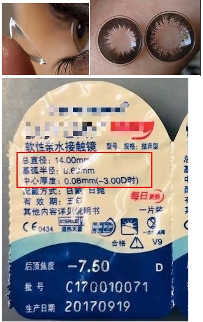
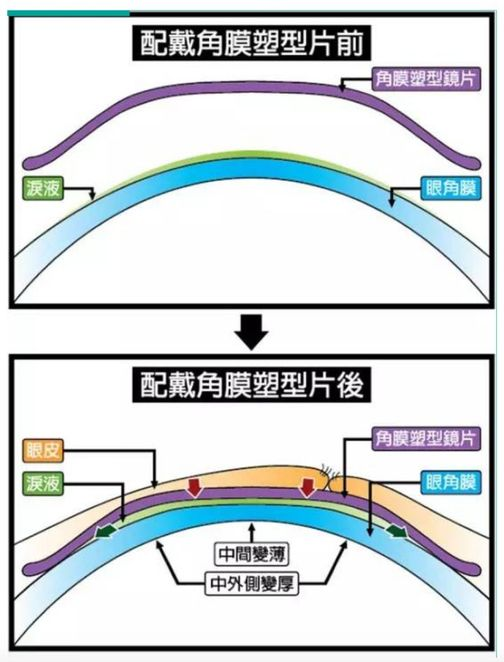
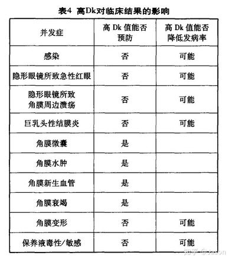
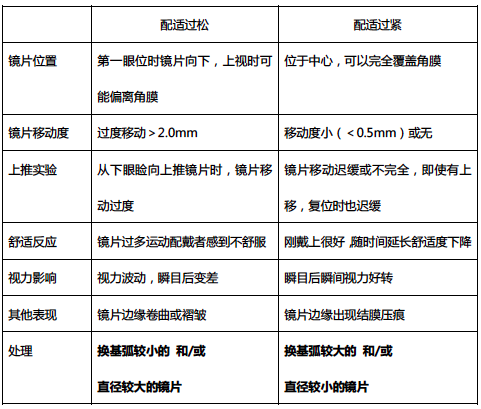
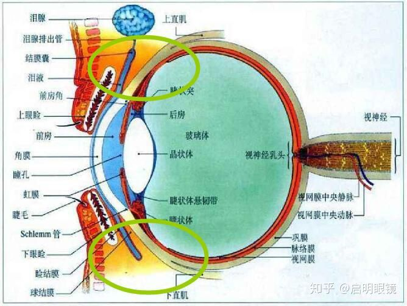
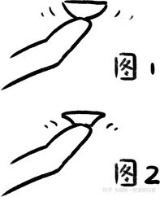
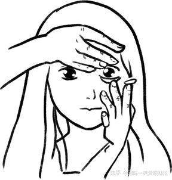

w-健康-器械-眼镜-隐形
=====================

关于 About
----------

* 标签：~wiki
* 创建：2020-10-13

内容 Content
------------

### 概述

隐形眼镜是**角膜接触镜**（Contact Lens）的俗称

1. 软性
    * 国家标准：透明度、硬度、韧度、抗张强度、含水量、折射率、氧传导性等一些列严格参数的要求。属于三类医疗器械（早在2012年，国家食品药品监督管理局发布消息称，隐形眼镜和美瞳属于较高风险的医疗器械产品，今后将正式纳入医疗器械监管范畴，未取得该类产品医疗器械注册证书，以及无证生产和经营该类产品的企业，一律都要按照《医疗器械监督管理条例》等有关规定严肃查处 ）[^20201013_150729]
    * 示例
        * 
    * 适用人群 [^20201013_150858]
        * 中高度屈光不正、屈光参差、无晶体眼不宜植入者。
        * 职业功能需求：运动员、司机、演员、司仪等。
        * 美容需要：模特、结婚、面试、COSPLAY等。
        * 医学美容：角膜白斑，眼球萎缩，虹膜异色症等。
        * 医疗需要：角膜屈光手术后、角膜移植术后、干眼、角膜病变缓释给药，眼睑闭合不全等。
2. 半硬性
3. 硬性
    * OK镜（Orthokeratologylens，角膜塑形镜）：夜间佩戴，采用一种特殊逆几何形态设计的角膜塑形镜片，其内表面由多个弧段组成。
        * 原理：镜片与泪液层分布不均，由此产生的流体力学效应改变角膜几何形态，在睡觉时戴在角膜前部，逐步使角膜弯曲度变平、眼轴缩短，从而有效地阻止了近视的发展，被誉为“睡觉就能控制和矫治近视的技术”。[^20201013_150729]
            * 
        * 适用人群 [^20201013_150729]
            * 符合角膜塑形镜佩戴的基本适应症，包括眼部无明显炎症疾病等。
            * 低中度近视，散光患者，并符合以下基本情况（矫正近视范围在-0.75—6.00D，以低于-4.00D为理想矫治范围。角膜顺规散光小于1.50D，逆规散光小于1.00D相对合适，近视-6.00D以上，散光1.50D以上的近视患者验配，需由专业医师酌情考虑处方。）
            * 有极好的依从性，能依照医嘱按时复查并按时更换镜片，签署知情同意书。
            * 未成年儿童需要有家长监护，并确定全备镜片佩戴应有的自理能力。
    * RGP（Rigid Gas Permeable）：日间佩戴
        * 特点 [^20201013_150729]
            * 优点：透氧性好（镜片材料所含的硅、氟等聚合物，能够大大增加氧气的通过量）、湿润性好、抗蛋白沉淀
            * 缺点：镜片过硬（舒适感差）
        * 适用人群 [^20201013_150729]
            * 适用于有需求而又无禁忌症的任何年龄顾客
            * 近视，远视，散光，屈光参差，其中高度近视、远视和散光可优先考虑选择
            * 圆锥角膜及角膜瘢痕等导致的不规则散光
            * 眼外伤，手术后无晶状体眼
            * 角膜屈光手术后或角膜移植后出现异常
            * 因眼部健康情况不适合继续使用软性隐形眼镜的患者

### 软性角膜接触镜

#### 参数指标

* 眼部参数
    * 基弧值（Base Curve）：普遍在 8.0-8.8 之间（产品中最多见的是 8.6mm）眼珠/角膜的大小和曲线弧度 [^20190131_182700] 一般指角膜平坦方向曲率半径。[^20201015_162506]
        * 角膜屈光度（即曲率）*角膜曲率半径=337.5(其中角膜曲率的半径的单位为毫米) [^20201016_125704]
        * 硬镜、软镜的区别：一般软镜可选择余地大，硬镜尽量越接近理想值越好。
        * 散光：若 KS (steep 陡峭方向曲率)、KF（flat 平坦方向曲率）相差太大（即散光值大）则建议选择散光镜片，并参考平均K值（AvgK）。
        * 测量的基弧值不是隐形眼镜基弧值，换算成隐形眼镜基弧值，需要x0.6~0.8 [^20201015_162506] 或乘 1.1 [^20201016_125704]
    * 直径Φ
    * 近视度数：与框架眼镜的度数有转换关系，见验配。
    * 散光度数：含有散光度数的隐形眼镜比较少，比较贵，但散光度数高可考虑。[^20210111_174321]
* 外观
    * 透明片
    * 彩片（非透明，「美瞳」是强生公司的注册名称）
* 厚度
    * 通常镜片越薄，含水量会越高，透氧性也会越好。[^20190131_182700]
* 材料
    * 水凝胶（聚甲基丙烯酸羟乙酯 Poly -HEMA 水凝胶）
        * 特点：软（佩戴舒适）、力学强度高；透氧性（DK≤20）差；[^20201015_141609]
        * 分类：离子和非离子（更不容易吸附眼睛分泌的蛋白质，长周期首选）材质。
    * 硅水凝胶（氟硅氧烷水凝胶聚合物，水凝胶材质和有机硅分子聚合起来的一种材质）
        * 特点：透氧性好（DK>50）[^20201015_141609]；相对于水凝胶更易吸附蛋白质故周期较短（未沉积就扔了）。[^20201013_150342]
* 抛弃周期：越短越软，更难戴入——新手可从月抛练起。
    * 日抛
    * 双周抛（半月抛）/月抛
    * 半年抛/年抛：不建议使用。2015年4月起，日本已经禁止半年抛（含）以上隐形眼镜。[^20201013_150729]
        * 时间长了蛋白沉淀很难清除干净。[^20190131_182700]
        * 并且镜片划痕等磨损通常会很严重。[^20190131_182700]
        * 每日清洁隐形眼镜和消毒，仍然有高达40-60%的隐形眼镜人群因阿米巴感染出现眼球不适症状，尤其是用眼不卫生者更容易感染。[^20190131_182700]
* 透氧性（DK）：眼球是直接通过空气来进行氧气交换的，透氧性越高越好 [^20201015_141609]
    * 
* 含水量：40%-60%合适 [^20190131_182700]
    * 不过含水量过高，镜片可能反而会吸取眼睛的水分，有可能加重眼睛干涩的症状。

#### 验配

* 健康检查：第一次佩戴前做眼部检查（医院眼科），评估：
    * 角膜状态：有没有角膜、结膜的擦伤、炎症（如沙眼），结石滤泡，或圆锥角膜等 [^20201016_134520]
    * 泪液分泌：泪液量、质量等
    * 眼压等。[^20190131_182700]
* 验光
    * 屈光度数 [^20190131_182700]

        | 框架眼镜    | 隐形眼镜         |
        | ----------- | ---------------- |
        | 400 度以下  | 参考框架眼镜度数 |
        | 400-600 度  | 减掉 25 度       |
        | 600-800 度  | 减掉 50 度       |
        | 800-1000 度 | 减掉 75 度       |
        | 1000 度以上 | 减掉 100 度      |

    * 散光度数
        * 散光度数不大，如-1.00 度（100 度）以内的散光，可将散光度的 1/2 加在隐形眼镜度数（未加散光）上，即换算后的对应的最后的隐形眼镜度数。如看我眼睛近视度数 450 度，散光度 75 度，换算后度数 `-4.25+(-0.755/2)=-4.625`，取偏浅的度数即 -4.50（450 度）。[^20210111_174321]
        * 散光度数过大，普通的隐形眼镜无法达到很好的矫正效果了，最好定制带散光度数的隐形或者硬性隐形眼镜（RGP）。[^20190131_182700]
    * 基弧值（眼珠/角膜的大小和曲线弧度）[^20190131_182700]
* 试戴：判断选择的隐形眼镜参数合适不合适（主要是基弧值和直径）[^20201015_162519]
    * 镜片基弧无法满足时，可通过改变镜片直径去修正；镜片直径无法满足时，可通过镜片基弧去修正。
        * 
    * 中心定位，覆盖度滑动度清晰度 [^20201016_134520]
* 订购
    * 特别注意不要在没有实际佩戴经验的情况下就去网购（[医院里的眼科可以配隐形眼镜吗？ - pennyliu999的回答 - 知乎](https://www.zhihu.com/question/266167481/answer/304078693)）。
* 复查

#### 选购

* 不考虑成本，直接选择**硅水凝胶日抛** [^20201013_150342]
* 考虑成本、佩戴频率低，硅水凝胶双周抛/月抛 [^20201013_150342]
* 不在任何情况下，购买比月抛周期更长的产品 [^20201013_150342]

#### 使用方法

* 准备
    * **洗手**（重点是手心/食指/中指/大拇指 [20210110@康宁眼镜]）
    * 用护理液冲手指 [^20190131_182700]
    * （也可一次性隐形眼镜夹和吸盘，若有）[^20201013_150858] 但用具也需要消毒 [20210110@康宁眼镜]
* 佩戴
    * 位置：结膜囊 [^20201013_150446] 故不可能跑到眼球后面。
        * 
    * 步骤
        * 分清正反
            * 
            * 正面：如图1，边缘呈碗状的正圆形则为正面 [^20201013_150858] 深度比较深、边缘往里收（像碗）的是正面 [20210110@康宁眼镜]
            * 反面：如图2，如果边缘是向外翘起就是反面 [^20201013_150858] 比较浅，边缘像盘子的是反面 [20210110@康宁眼镜]
            * 如果正反戴错了，过会儿眼睛会疼、沙得慌 [20210110@iVivian]
        * 拉开眼睑 [^20201013_150858]
            * 左右手分别扒上下，让整个黑眼珠露在外面不要有藏在眼睑里的部分 [20210110@康宁眼镜]
        * 佩戴：将镜片置于角膜前 [^20201013_150858] 看着眼镜慢慢贴上 [20210110@康宁眼镜]
            * 
        * 调整
            * 往下看保证上半部分贴合 [20210110@康宁眼镜]
            * 闭上眼睛，眼珠左右转动一下，确认眼镜有没有完全贴合。[^20201013_150858]
    * 技巧
        * 如果眼镜是反的，戳到另一只手手心，然后用食指搓搓正 [20210110@康宁眼镜]
        * 如果眼镜很大部分贴在手指上，而不能形成碗状，则两个手指互相倒倒，并在中间过程中抹去一些手指上的水分 [20210110@康宁眼镜]
* 摘下
    * 步骤
        * 洗手，再用护理液冲手指 [^20190131_182700]
        * 拉开眼睑，用手指捏下来即可
    * 技巧
        * 如果有美甲或者指甲长出手指太多，无法用指尖摘下眼镜，用食指和大拇指侧面捏下。[20210912@iVivian]
* 清洁（日抛如果中途没有摘，则不需要）
    * **认真搓洗，并用护理液冲洗干净**（丢在清洗器里那不叫清洁，那叫安慰自己） [^20201013_150342]
* 保存
    * 只有戴在眼睛上才会有损耗，试戴两下的日抛也可以放在护理液暂时保存 [20210110@康宁眼镜]

#### 配件

* 护理液
    * 注意事项
        * 使用时一定不能触碰瓶口。[^20201013_150858]
        * 必须在保质期内使用。[^20190131_182700]
        * 建议买小包装，开封 1 个月内能用完更好。时间越长，越容易滋养细菌，通常 3 个月内使用不完建议就换个新的。[^20190131_182700]
* 眼镜盒（及隐形眼镜夹、吸盘）
    * 注意事项
        * 定期清洗：80°左右水烫（仅放眼镜的小盒子，外面的大盒子是硬塑料不能烫）[20210110@康宁眼镜]
        * 不建议用吸盘戴眼镜，不好掌握距离容易戳到眼睛 [20210110@康宁眼镜]

#### 问题与风险

* 角膜缺氧
    * 说明：角膜无法吸收足够的氧气进行新陈代谢，能导致角膜上皮缺氧，乳酸积累过多，角膜上皮细胞形态学发生变化，角膜因此变薄（角膜内皮细胞是不可再生的）[^20201015_141609] 一说，一般损耗的是角膜上皮细胞，上皮细胞是可以再生的。
    * 缓解方式，用更高透氧性的角膜接触镜（但是无法彻底解决，因为覆盖一个镜不可能和什么都不放在眼珠子上一样）

#### 注意事项

* **不要戴**的情况！
    * 个人情况
        * 眼部炎症、干眼、眼压过高、泪道堵塞或泪液分泌减少、或其他眼病 [^20190131_182700]
        * 做完视力纠正手术者1年内 [^20201013_150729]
        * 严重糖尿病、妊娠等全身疾病 [^20190131_182700] [^20201013_150729]
            * 月经前、月经期间眼压偏高，眼周易充血 [^20201013_150729] 一说，没关系。
        * 炎症、感冒等免疫力低的情况。[^20190131_182700]
            * 感冒药中也可能含有抑制眼泪分泌的成分。[^20201013_150729]
    * 环境情况
        * 烟雾、粉尘、挥发性酸碱物等工作环境 [^20190131_182700] [^20201013_150729]
            * 雾霾天气。[^20201013_150729]
        * 游泳、洗澡等接触水的情况。[^20190131_182700]
        * 高海拔 [^20201013_150858]、坐飞机等缺氧、压力变化的场景。[^20190131_182700]
        * 长距离骑车（容易干燥变硬，最好和风镜、太阳镜一起使用）等空气流动过快的场景。[^20201013_150729]
        * 靠近火源、高温的场景（如炭火、**火锅**）[^20201013_150750]
* 戴/取之前要注意
    * 化妆的顺序：先戴镜再化妆，先摘镜后卸妆。[^20190131_182700]
* 戴的时候要注意
    * 时间长度：一般不要超过12小时，不超过8小时更安全，**千万不能过夜**！[^20190131_182700]
    * **不能进行剧烈对抗性、球类运动**，万一击中、撞到眼部，软镜产生微小的碎裂，掉进结膜里面又很难取出。运动推荐框架眼镜+防滑绳或近视防风护目镜。[20201013_150858@评论区]
    * 眼睛如果出现不适，那就尽快摘掉隐形，观察下，要是不适的感觉持续存在，那就尽快去医院看。[^20190131_182700]
    * **千万不能揉眼睛！！！**[^20201013_150750]
    * 若找不到眼镜、有异物感，可转眼球直到掉出（可能在上/下眼皮里，不可能跑到眼球后面）；若无异物感，一般是掉出去了。[^20201015_165815]
* 其他
    * 清洁到位，**定期复查** [^20201016_105427]

废弃 Deprecated
---------------

参考 Reference
--------------

[^20190131_182700]: * [x] [不伤眼的隐形眼镜，应该这么挑！https](//mp.weixin.qq.com/s/tJsgFVWv1DhgrvpHjIlzZQ)
[^20201013_150342]: * [x] [隐形眼镜日抛、月抛、半年抛怎么选择？ - 草小马的回答 - 知乎 https](//www.zhihu.com/question/21098734/answer/457632860)
[^20201013_150446]: * [x] [隐形眼镜真的会跑到后眼球么。。。？ - 启明眼镜的回答 - 知乎 https](//www.zhihu.com/question/30846585/answer/386194341)
[^20201015_165815]: * [x] [隐形眼镜真的会跑到后眼球么。。。？ - 视光师金鑫的回答 - 知乎 https](//www.zhihu.com/question/30846585/answer/433136750)
[^20201013_150729]: * [x] [干货：必备的隐形眼镜知识（附精选10条Q&A） - 无界眼镜MaxLess的文章 - 知乎 https](//zhuanlan.zhihu.com/p/48029008)
[^20201013_150750]: * [x] [第一次配隐形眼镜该注意什么？ - 良目视光的回答 - 知乎 https](//www.zhihu.com/question/19953537/answer/667999956)
[^20201013_150858]: * [x] [软性角膜接触镜宝典 - 回眸一笑爱眼科技的文章 - 知乎 https](//zhuanlan.zhihu.com/p/36253326)
[^20201015_141609]: * [x] [什么是硅水凝胶，有什么特点。怎么区分？ - Jason的文章 - 知乎 https](//zhuanlan.zhihu.com/p/54564299)
[^20201015_162506]: * [x] [怎么从角膜图看基弧呢？ - 视觉系大师于青的回答 - 知乎 https](//www.zhihu.com/question/424858719/answer/1515552075)
[^20201015_162519]: * [x] [如何判断隐形眼镜的基弧是否合适？ - 博士伦隐形眼镜的回答 - 知乎 https](//www.zhihu.com/question/24001923/answer/554510524)
[^20201016_105427]: * [x] [长期佩戴硅水凝胶美瞳会有什么危害？ - 视光师金鑫的回答 - 知乎 https](//www.zhihu.com/question/424574215/answer/1515332706)
[^20201016_125704]: * [x] [什么是隐形眼镜的基弧，需要怎么换算和选择产品基弧 - Jason的文章 - 知乎 https](//zhuanlan.zhihu.com/p/41280163)
[^20201016_134520]: * [x] [戴隐形眼镜之前必须去医院检查吗？ - 向阳花CD的回答 - 知乎 https](//www.zhihu.com/question/40758365/answer/394324362)
[^20210111_174321]: * [x] [隐形眼镜度数换算方法 - 无界眼镜MaxLess的文章 - 知乎 https](//zhuanlan.zhihu.com/p/43234468)
