w-通信-蜂窝-架构
================

关于 About
----------

* 标签：~wiki
* 创建：2023-10-19

### 摘要

移动通信网络架构

内容 Content
------------

### 基本结构

> 目标：低延时、高精度、低能耗！[^20231019_163115]

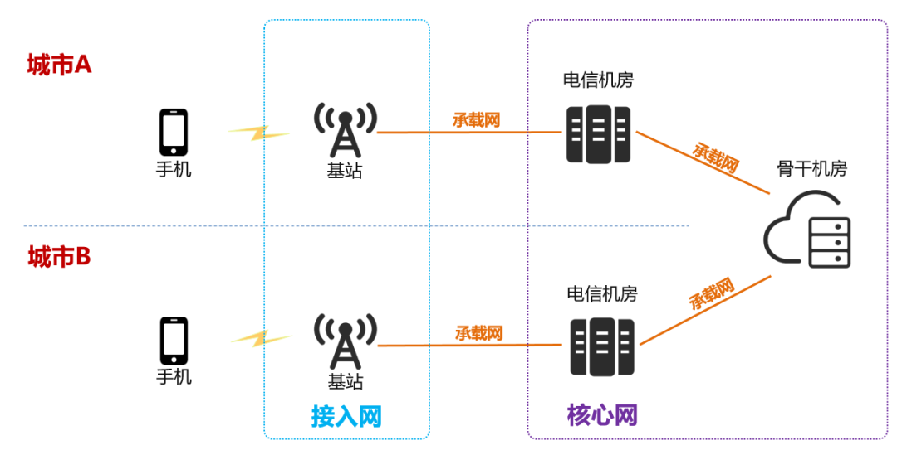 [^20231019_150557]

1. 核心网（骨干层）：相当于一个巨大的路由器
2. 承载网（汇聚层）
3. 接入网（接入层）：将通信终端连起来的网络，无线接入网的作用就是有线信号和无线信号之间的转换
    * 基站是接入层设备

#### 4G、5G 网络架构示意

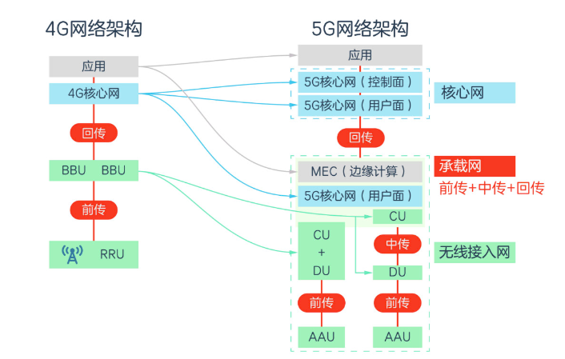

其中，传输路径称前传（Fronthaul）、中传（Midhaul）、回传（Backhaul）。4G 只有前传、回传，5G 有前传、中传、回传（CU、DU 合并部署时没有中传）。

### 接入网（Access Network）

蜂窝移动网络中的接入网，一般称**无线接入网（Radio Access Network，RAN）**。负责把数据收集起来。

#### 控制器拓扑

1. 2G、3G：多个基站由一个基站控制器管理，多个基站控制器由核心网管理。
    * 2G 的基站控制器叫基站控制器（BSC：Base Station Controller）
    * 3G 的基站控制器叫无线网络控制器（RNC：Radio Network Controller）
    * 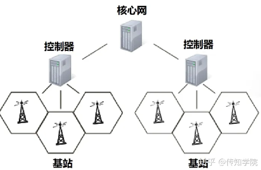 [^20231016_171431]
2. 4G：为了降低延时去掉了基站控制器，核心网直接管理基站。核心网中央集权负荷太大，放权给基站点对点调配资源效率低、效果差。[^20231016_171431]
    * 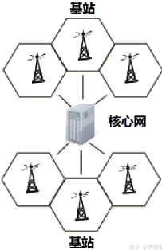 [^20231016_171431]
3. 5G：回到 2G、3G 的思路，将 4G 基站拆成集中单元（CU）和分布单元（DU）。既可以一个 CU 管理多个 DU，核心网管理 CU，也可以核心网直接管理 CU+DU。具体是否进行DU和CU的拆分要看5G的发展阶段以及具体业务的时延需求。[^20231016_171431]
    * 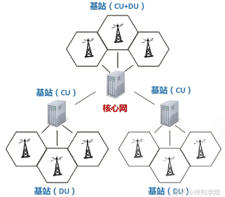 [^20231016_171431]

#### 设备与接口

1. 4G 接入网结构 [^20231019_150557]
    * BBU（Baseband Unit，基带处理单元）
        * 主要负责信号调制
    * RRU（Remote Radio Unit，射频拉远单元）
        * 主要负责射频处理
    * 前传接口（BBU 与 RRU 的接口）
        * Common Public Radio Interface (CPRI)
        * enhanced CPRI（eCPRI）
    * 馈线（连接RRU和天线）
    * 天线（负责线缆上导行波和空气中空间波之间的转换）
2. 5G 接入网结构 [^20231019_150557]
    * CU（Centralized Unit，集中单元）：PDCP
        * 将原 BBU 的**非实时部分**分割出来，定义为 CU，负责处理非实时协议和服务。[^20231019_150557]
        * 组成：可以进一步按照 CUPS（Control User Plan Separation）分为 CU-CP（Control Plane）、CU-UP（User Plane）[^20231016_170257]
    * DU（Distribute Unit，分布单元）：MAC/RLC
        * BBU 剩余功能重新定义为 DU，负责处理**物理层协议**和**实时服务**。[^20231019_150557]
    * AAU（Active Antenna Unit，有源天线单元）：PHY + 天线等
        * BBU 的部分物理层处理功能 + 原 RRU + 无源天线。[^20231019_150557]

#### 部署方式

* 考虑因素 [^20231019_150557]
    * 业务的传输需求（如带宽，时延等因素）
    * 建设成本投入
    * 维护难度

##### 基站部署

经典宏基站为例：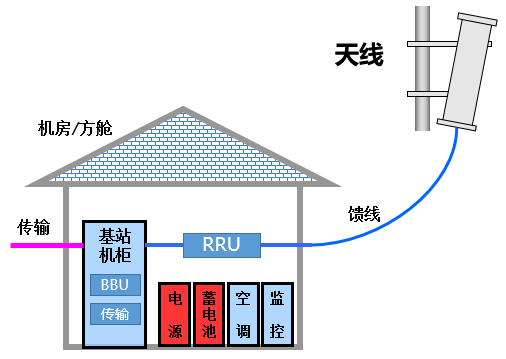[^20231019_143611]

* 基站规模 [^20231019_143611]
    | 名称                  | 别称和场景             | 单载波发射功率 | 覆盖能力  |
    | --------------------- | ---------------------- | -------------- | --------- |
    | 宏基站（Macro Site）  | 宏站，室外大铁塔       | 10W以上        | 200米以上 |
    | 微基站（Micro Site）  | 微站，室内或公共区域   | 500mW-10W      | 50-200米  |
    | 皮基站（Pico Site）   | 微微站，企业级小基站   | 100mW-500mW    | 20-50米   |
    | 飞基站（Femoto Site） | 毫微微站，家庭级小基站 | 100mW以下      | 10-20米   |
    * 微基站及以下也叫微小站，皮基站和飞基站也叫皮飞站。
    * 宏基站有时搭配直放站（一个信号中继器）解决信号盲区覆盖弱的问题。
    * 室内之所以不用宏基站是因为砖墙阻隔严重影响信号传播，大量使用微小基站；另外，室内经常使用“室内分布系统（简称室分）”从信源（微基站或直放站）接出馈线到各个房间，再利用天线发射出信号。
* 使用频段和基站部署的关系 [^20231019_143611]
    * 1G、2G 使用低频频段（800-900MHz），穿透能力好、单站覆盖范围大。
    * 后来用户激增，开始使用 1700-1900MHz 频段，虽缓解容量问题但覆盖范围减小
    * 3G 网速高且低频段被 2G 占用，不得不使用 1800-2000MHz 以及 2000MHz+，覆盖效果不如 2G，偏远地区、偏僻脚轮往往只有 2G 信号。
    * 4G LTE 使用到了 2600MHz，室内信号更差。故催生了微小基站，用于室内覆盖。
    * 5G 将使用毫米波（类似 28GHz），覆盖范围更小，将会使用更多的小型化基站。
* 配套设施 [^20231019_143611]
    * 铁塔：搭载天线用的通信基础设施。
    * 机房：包括电源、蓄电池、空调、安防监控等配套设备。

##### 设备部署

* 1G 时代：BBU，RRU和供电单元等设备功能，都是被打包塞在一个柜子或一个机房里的。[^20231019_150557]
* 2G 时代：RRU 有时候会挂在机房的墙上，BBU 大部分时候是在机柜里，有时候也会挂墙安装。[^20231019_150557]
* D-RAN（Distributed RAN，分布式无线接入网）：2、3、4G 前中期使用，RRU 不再放在室内，被搬到了天线的身边（室外）。[^20231019_150557]
    1. 缩短 RRU 和天线之间馈线的长度，即可减少信号损耗又可降低馈线成本
    2. 可以让网络规划更加灵活
* C-RAN：集中了 BBU，将很多 BBU 集中在一个机房或方舱内形成基带池，每个 BBU 能连接 10-100 个 RRU。[^20231019_150557]
    * 大大节省了运营商的租赁和建设更多的室内机房或方舱的成本。
    * 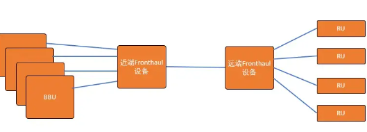 [^20231019_173726]
* E-RAN：4G LTE-A 中开始、在 5G NR中得到较大面积应用。可以让不同 BBU 之间实现载波聚合（CA）功能。
    * 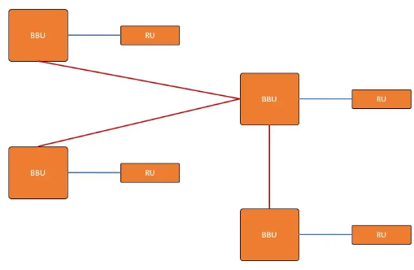 [^20231019_173726]
* NG-RAN（Next Generation-~）：5G 使用的接入网部署方式之一。
    * [NG-RAN Architecture](https://www.3gpp.org/news-events/3gpp-news/ng-ran-architecture) [20231019]
* O-RAN（Open-~）：NG-RAN 的进化版 [^20231016_170257]
    * 用通用的硬件和开源软件实现，分为三层
        1. COTS（Commercial off-the-shelf）芯片：如 x86 处理器
        2. 硬件抽象层（Hardware Abstraction Layer）
        3. 软件层（Application Layer）：跑 RF（RAN Functions）
    * 核心网用云端平台，跑 Network Functions
    * 可以使用标准技术如 DPDK、FD.io、CNAP/CPPE 等
* vRAN：另一种概念 [^20231019_174305]
    * 虚拟化无线接入网络（vRAN）是电信运营商以软件形式运行其基带功能的一种方式。虚拟化无线接入网络（RAN）的一大优势在于 RAN 功能不再需要通过特殊的专有硬件来运行，而是可以在标准服务器上运行。这是因为我们将虚拟化原理应用到了 RAN，通常它是更大规模的网络功能虚拟化（NFV）的一部分。

##### 5G 部署方式举例

> 依据5G提出的标准，CU、DU、AAU可以采取分离或合设的方式 [^20231019_150557]

* 网络部署形态可能性 [^20231019_150557]
    1. 与传统 4G 宏站一致，CU 与 DU 共硬件部署，构成 BBU 单元。
    2. DU 部署在 4G BBU 机房，CU集中部署。
    3. DU 集中部署，CU 更高层次集中。
    4. CU 与 DU 共站集中部署，类似 4G 的 C-RAN 方式。
* 举例
    * 车联网这样的低时延要求场景，DU 就要想办法往前放（靠近AAU部署）。在这类场景下，MEC也会被引入网络，发挥作用。[^20231019_150557]

### 承载网（Bearer Network）

交通，负责把数据送来送去的。[^20231019_161430]

* 表现形式 [^20231019_143611]
    * 以前基本使用电缆
    * 后来数据业务激增，开始使用网线、光纤光缆
* 代表性设备 [^20231019_143611]
    1. PTN（Packet Transport Network，分组传送网）
    2. OTN（Optical Transport Network，光传送网）：400G OTN（5G 时代）的单载波承载能力达到 400G。

#### 5G 承载网

* 关键性能指标 [^20231019_163115]
    1. 灵活调度
    2. 高精同步
    3. 低时延
    4. 大带宽
    5. 网络切片
* 关键技术 [^20231019_163115]
    1. FlexE：全称“Flex Ethernet”，灵活以太网。
        * 可以用于解决物理链路带宽不足和高时延的问题，实现带宽扩展和超低延时传输。至于它是怎么实现？简言之，就是把多个物理端口进行“捆绑合并”，形成一个虚拟的逻辑通道，以支持更高的业务速率。
        * 举例：客户业务速率是400GE，但设备物理通道端口的速率是25GE、100GE或其它速率。那么，通过端口捆绑和时隙交叉技术，就能轻松实现业务带宽25G->50G->100G->200G->400G->xT的逐步演进。
    2. FlexO：全称“Flex Optical Transport Network”，灵活光传输网
        * 通过绑定多个标准速率接口，实现超100G OTN高速率信号的传输。
        * 其实FlexO和FlexE的逻辑很像：FlexE是用在PTN网络，处理以太网信号，而FlexO是用在OTN网络，处理OTUCn信号。两者都是通过多端口绑定实现大颗粒度信号的传输。
    3. SR：全称“Segment Routing”，分段路由。
        * 它是承载网中很受关注的技术，由CISCO提出，是一种源路由机制。
        * 基于原MPLS上有了创新【是一种新型MPLS技术】。可实现：降低海量场景下网络连接的复杂程度，提高业务路由的转发效率。
        * MPLS是通过事先分配好的标签，为报文建立一条标签转发通道（LSP），在通道经过的每一台设备处，只需要进行快速的标签交换即可（一次查找），从而节约了处理时间。
        * 既然SR技术源自MPLS，那么简单来说，它也是一种“不管中间节点”的路由技术，免了网络中间节点路径计算。灵活性更高，开支更少，效率更高。
    4. 高精度时钟：采用时钟和时间双网合一、时钟源下沉至前传网等技术实现高精度的时钟同步功能。
        * 总之，承载网之所以需要超高精度时间同步，原因是多方面的：如：5G的载波聚合、多点协同和超短帧要求空口之间的时间同步精度偏差小于260ns。5G的基本业务采用时分双工（TDD）制式，要求任意两个空口之间的相对精度偏差小于1.5μs等。

### 核心网（Core Network）

本身是一个复杂的网络。广义上的解释难以界定，而狭义角度的解释又没有对应实体。主要负责管理数据，对数据进行分拣，告诉他们该去往何方。故**路由和交换是核心网的本质**。[^20231019_161430]

#### 结构

1. 2G（GSM）核心网结构 [^20231019_143611]：只有打电话功能，没有网络功能。
    * 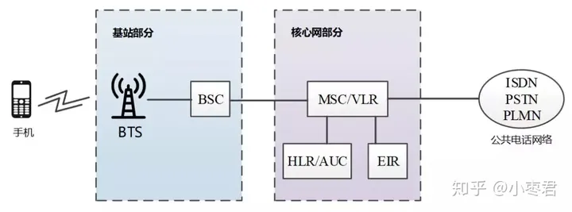
    * MSC就是移动交换中心，核心网的最主要设备。HLR、EIR和用户身份有关，用于鉴权。
    * 用电缆为主，电缆划分为好多路通道，通常称为电路，不同的电路给不同的用户占用，用于通话。这样专有通道占用的交换方式，叫做电路交换。所以，2G 核心网的MSC之类设备，也叫做电路核心网设备。
2. 2.5G（GPRS）[^20231019_143611]：加入数据业务
    * 核心网在原有 CS 电路核心网的基础上，又有了 Packet Switch 核心网（PS 核心网），用分组/包交换的方式，不再是独占通道，而是发数据包。
3. 3G [^20231019_143611]：在 2.5G 基础上定型。
    * 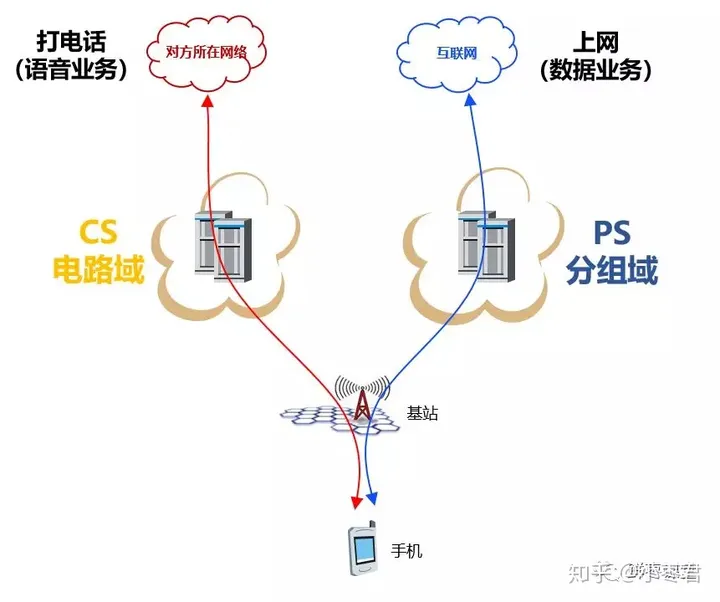
4. 4G LTE [^20231019_143611]
    * 初期：将 3G 的 PS 核心网升级至 LTE，打电话使用 2/3G 的 CS 网络。
    * 后期：3GPP 用 IMS（IP Multimedia Subsystem，IP 多媒体子系统）替代 CS，提供包括打电话在内的多媒体服务。这种方案使用户可同时打电话+上网，即 VoLTE。
5. 5G NR（New Radio）[^20231019_143611]
    * 数据业务使用 5G NR，电话业务依靠 IMS，即 VoLTE -> VoNR。

#### 网元

2/3/4G 重要网元：MME、SGW、PGW [^20231019_163115]

> 每一代通信标准，每一项具体制式。都拥有属于自己的网络架构、硬件平台、网元及设备。所以，2G、3G、4G的核心网和 5G 核心网之间还是有很大变化的。
>
> 5G核心网**将控制面和用户面彻底分离**。

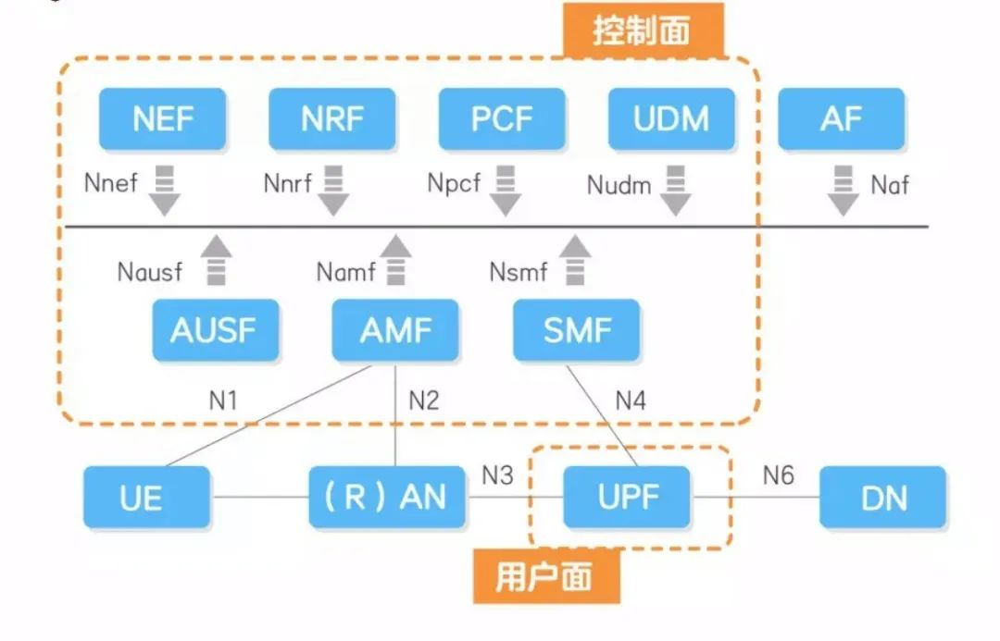[^20231019_163115]

* 控制面网元（Network Function）[^20231019_163115]
    * 用户相关
        * AMF（Access and Mobility Management Function，接入及移动性管理功能）：负责用户的移动性和接入管理。
        * SMF（Session Management Function，会话管理功能）：负责用户会话管理功能。
        * AUSF（Authentication Server Function，鉴权服务器功能）、UDM（Unified Data Management，统一数据管理）：负责数据管理；UDM负责前台数据的统一处理，包括用户标志、用户签约数据、鉴权数据等；AUSF配合UDM专门处理鉴权数据相关的处理。
    * 网络平台相关（新增的）
        * NEF（Network Exposure Function，网络开放功能）
        * NRF（NF Repository Function，网络存储功能）
        * NSSF（Network Slice Selection Function，网络切片选择功能）：此功能可以单独列出
    * 其他
        * UDR（Unified Data Repository，统一数据存储）
        * UDSF (Unstructured Data Storage Network Function ，非结构化数据存储功能)
        * PCF（策略控制功能）：支持统一策略框架，提供策略规则。
* 用户面网元 [^20231019_163115]
    * UPF（User Plane Function，用户面功能）：全权掌控用户面大局。

### 5G 架构和技术思维导图

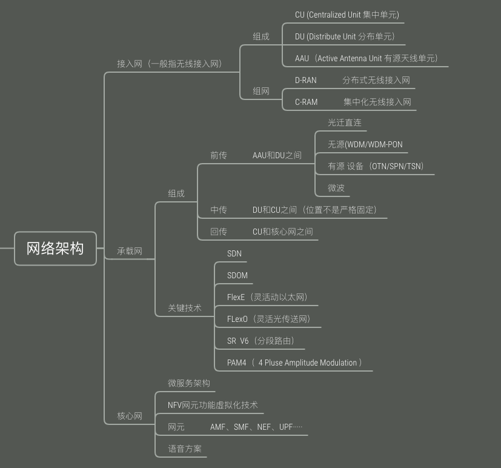[^20231019_150557]

参考 Reference
--------------

[^20231019_143611]: * [x] [谁能告诉我什么是承载网，核心网和接入网? - 小枣君的回答 - 知乎](https://www.zhihu.com/question/325934238/answer/826772440)
[^20231019_150557]: * [x] [5G接入网，原来如此简单！【强干货】](https://mp.weixin.qq.com/s?__biz=MzU2OTc3NzI1OA==&mid=2247487464&idx=1&sn=051d2760912c4d45d08e4aeded3659a3)
[^20231016_171431]: * [x] [三分钟，看懂“移动通信网络” - 传知摩尔狮的文章 - 知乎](https://zhuanlan.zhihu.com/p/258889472)
[^20231019_161430]: * [x] [核心网“入门级”科普，你看了没？](https://mp.weixin.qq.com/s?__biz=MzU2OTc3NzI1OA==&mid=2247487525&idx=1&sn=654f0a2484e47e4e080a6f91ffb7e208)
[^20231019_163115]: * [x] [一文搞懂，5G承载网！轻松学习](https://mp.weixin.qq.com/s?__biz=MzU2OTc3NzI1OA==&mid=2247487478&idx=1&sn=28dfa13f44c882ad646ad25fdaba4510)
[^20231019_173726]: * [x] [D-RAN, C-RAN以及E-RAN简介 - 葫芦的文章 - 知乎](https://zhuanlan.zhihu.com/p/390877868)
[^20231019_174305]: * [x] [什么是 vRAN？](https://www.redhat.com/zh/topics/virtualization/what-is-vran)
[^20231016_170257]: * [x] [What is an Open Radio Access Network (O-RAN)?](https://www.metaswitch.com/knowledge-center/reference/what-is-an-open-radio-access-network-o-ran)