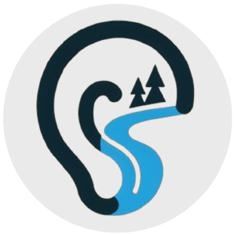

✋Hi, 我是 Brooke
=================

创建 [{:width="18px"}](assets/favicon.png) **听溪** 的初衷，是方便给朋友们分享笔记。

点击上方 tab 名字即可浏览内容~

创建工具
--------

* Markdown 网页渲染：[MkDocs](https://www.mkdocs.org/)、[Material for MkDocs](https://squidfunk.github.io/mkdocs-material/)
* 静态网页托管：[Read the Docs](https://readthedocs.org/)
* 评论和代码托管：[giscus](https://giscus.app/)、[GitHub](https://github.com/)

感兴趣可参考 [DocGuide](https://zjdoc-docguide.readthedocs.io/zh-cn/latest/) 或联系我。

共享规则
--------

Contents in this site by <a href="https://github.com/brooke-yucx" target="_blank" rel="noopener">Brooke Yu</a> is licensed under <a href="http://creativecommons.org/licenses/by-nc/4.0/?ref=chooser-v1" target="_blank" rel="license noopener noreferrer" style="display:inline-block;">CC BY-NC 4.0</a>
